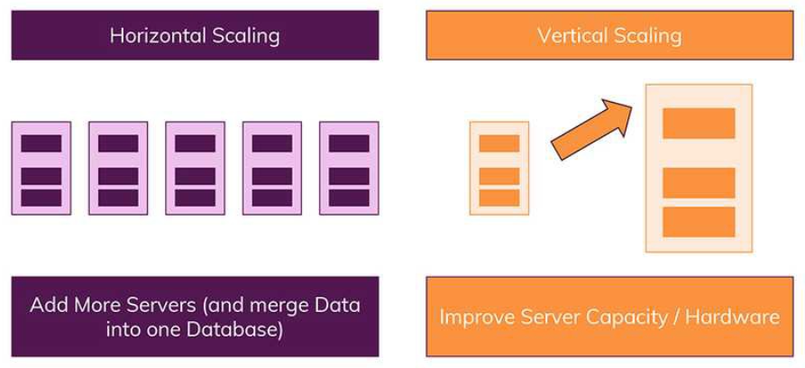
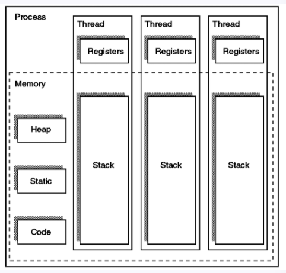
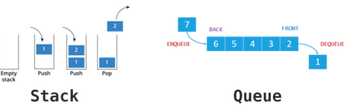

[TOC]

# CS

## 1. MySQL :vs: NoSQL

### 1) MySQL (관계형 데이터베이스)

- SQL => Structured Query Language, 데이터베이스와 상호작용 하는데 사용하는 쿼리 언어 

- 관계형 데이터베이스 특징

  - 데이터는 정해진(엄격한) 데이터 스키마를 따라 데이터베이스 테이블에 저장된다.
  - 데이터는 관계를 통해서 연결된 여러개의 테이블에 분산된다.

  

> 1. **엄격한 스키마**
>
> - 데이터는 테이블에 레코드로 저장, 각 테이블에는 명확하게 정의된 구조가 있음. 
>   - 구조란 어떤 데이터가 테이블에 들어가고 어떤 데이터가 그렇지 않을지를 정의하는 필드 집합 
>   - 구조는 필드의 이름과 데이터 유형으로 정의
> - 관계형 데이터베이스에서 스키마를 준수하지 않는 레코드는 추가할 수 없음. 
>
> 
>
> 2. **관계**
>
> - 데이터들을 여러개의 테이블에 나누어서, 데이터들의 중복을 피할 수 있음. 
> - 다른 테이블에서 부정확한 데이터를 다룰 위험이 없다는 장점

### 2) NoSQL (비관계형 데이터베이스)

- SQL과 반대되는 접근 방식
  - 스키마 없음
  - 관계 없음
- 일반적으로 관련 데이터를 동일한 컬렉션에 넣는다. 
  - Orders 컬렉션에 Users나 Products 정보 또한 포함해서 저장이 가능
  - 여러 테이블/ 콜렉션 조인이 필요 없음. 
- 데이터가 중복되기 때문에 불안정한 단점 
  - 컬렉션 B에서 데이터를 수정하지 않았는데, A에서만 데이터를 업데이트 할 위험
  - 특정 데이터를 같이 사용하는 모든 컬렉션에서, 똑같은 데이터를 업데이트 수정되도록 해야한다.
- 조인을 사용할 필요가 없다는 큰 장점 
  - 자주 변경되지 않는 데이터 일때 더 큰 장점

### 3) 수직적(Vertical) & 수평적(Horizontal) 확장(Scaling)

> 1. **수직적 확장**
>    - 단순히 데이터베이스 서버의 성능을 향상시키는 것 
>    - ex ) CPU를 업그레이드 하는 방식
> 2. **수평적 확장**
>    - 더 많은 서버가 추가되고, 데이터베이스가 전체적으로 분산됨 
>    - 하나의 데이터베이스에서 작동하지만 여러 호스트에서 작동
>
> 
>
> *** SQL 데이터 베이스는 일반적으로 수직적 확장만을 지원 
>
> *** 수평적 확장은 NoSQL 데이터베이스에서만 가능 

### 4) 장/단점 정리

> #### 1. SQL 장점
>
> - 명확하게 정의 된 스키마, 데이터 무결성 보장 
> - 관계는 각 데이터를 중복없이 한번만 저장됨 
>
> #### 2. SQL 단점
>
> - 상대적 덜 유연, 데이터 스키마는 사전에 계획되고 알려져야 한다. (후에 수정은 불가능 할 수도 있다.)
> - 관계를 맺고 있기 때문에, JOIN문이 많은 매우 복잡한 쿼리가 만들어 질 수 있음
> - 대체로 수직정 확장만 가능, 즉, 어떤 시점에서(처리량과 관련하여) 성장 한계에 직면하게 됨

>#### 1. NoSQL 장점
>
>- 스키마가 없기 때문에 훨씬 유연, 즉, 언제든지 저장된 데이터 조정하고 새로운 필드 추가 가능 
>- 데이터는 애플리케이션이 필요로 하는 형식으로 저장됨, 데이터를 읽어오는 속도가 빨라짐
>- 수직 및 수평 확장이 가능, 데이터 베이스가 애플리케이션에서 발생시키는 모든 읽기/쓰기 요청을 처리할 수 있음
>
>#### 2. NoSQL 단점
>
>- 유연성 때문에, 데이터 구조 결정을 하지 못하고 미루게 될 수도 있음
>- 데이터 중복은 여러 컬렉션과 문서가 여러 개의 레코드가 변경된 경우 업데이트 해야 함
>- 데이터가 여러 컬렉션에 중복되어 있기 때문에, 수정해야 하는경우 모든 컬렉션에서 수행해야 함 

> #### SQL을 사용하면 좋은 경우 ? 
>
> - 관계를 맺고 있는 데이터가 자주 변경(수정)되는 애플리케이션일 경우
>
>   ( NoSQL 에서는 여러 컬렉션을 모두 수정해줘야 하기 때문에)
>
> - 변경될 여지가 없고, 명확한 스키마가 사용자와 데이터에게 중요한 경우

> #### NoSQL을 사용하면 좋은 경우?
>
> - 정확한 데이터 구조를 알 수 없거나 변경/ 확장 될 수 있는 경우
> - 읽기 처리를 자주 하지만, 데이터를 자주 변경하지 않는 경우 
> - 데이터 베이스를 수평적으로 확장해야 하는 경우 (막대한 양의 데이터를 다뤄야 하는 경우)

## 2. Thread란 ?

> - 쓰레드란 **프로그램(프로세스)의 실행 단위**, 하나의 프로세스는 여러개의 쓰레드로 구성이 가능
>
> - 하나의 프로세스를 구성하는 쓰레드들은 프로세스에 할당된 메모리, 자원 등을 공유
>
> - 프로세스와 같이 실행, 준비, 대기 등의 실행상태 가짐 
>
> - 각 쓰레드별로 자신만의 스택과 레지스터 가짐
>
>   
>
> - 한 순간에는 하나의 쓰레드만 실행 가능

#### 1) 프로세스와 쓰레드의 차이

> **프로세스** : 운영체제로부터 자원을 할당받는 작업의 단위
>
> - 프로세스는 실행 중인 프로그램으로 디스크로부터 메모리에 적재되어 CPU 할당을 받을 수 있는 것

> **쓰레드** : 프로세스가 할당받은 자원을 이용하는 실행의 단위
>
> - 한 프로세스 내에서 동작되는 여러 실행 흐름, 프로세스 내의 주소 공간이나 자원 공유
> - 각각의 쓰레드는 독립적인 작업 수행, 각각의 stack과 PC resister를 가지고 있다. 

> **스택을 쓰레드마다 독립적으로 할당하는 이유 ?**
>
> - 스택은 함수 호출 시 전달되는 인자, 되돌아갈 주소 값 및 함수 내에서 선언하는 변수 등을 저장하기 위해 사용되는 메모리 공간
> - 스택 메모리 공간이 독립적이라는 것은 독립적인 함수 호출이 가능하다는 것, 이는 독립적인 실행 흐름이 가능하다
> - 독립적인 실행 흐름을 위한 최소 조건으로 독립된 스택 할당

> **PB Resister를 쓰레드마다 독립적으로 할당하는 이유 ?**
>
> - PC 값은 쓰레드가 명령어의 어디까지 수행하였는지를 나타냄
> - 쓰레드는 CPU를 할당받았다가 스케줄러에 의해 다시 선점당함. 그렇기 때문에 명령어가 연속적으로 수행되지 못하고 어느 부분까지 수행했는지 기억할 필요가 있음.
> - 따라서 PC resister를 독립적으로 할당함. 

#### 2) 쓰레드의 장점

- 쓰레드는 프로세스보다 생성 및 종료 시간, 쓰레드 간 전환 시간이 짧다.
- 쓰레드는 프로세스의 메모리, 자원 등을 공유하므로 커널의 도움 없이 상호간에 통신이 가능하다. 

#### 3) 쓰레드 동기화 방법의 종류

- Mutex / semaphore / Monitor
  - 세가지 모두 운영체제의 동기화 기법

> **Mutex (Mutual Exclusion)**
>
> - 쓰레드의 동시 접근을 허용하지 않는다는 의미
> - 뮤텍스의 쓰레드 동기화 방법은 임계영역에 들어가기 위해 이 뮤텍스를 가지고 있어야 들어갈 수 있음

> **Semaphore**
>
> - 세마포어는 동시 접근 동기화가 아닌 접근 순서 동기화에 더 관련 있음

> **Monitor**
>
> - Mutex와 Queue을 가지고 있는 Synchronization 메카니즘

- Mutex, Monitor는 상호 배제, 임계 구역에 하나의 쓰레드만 들어갈 수 있다.
- Semaphore는 하나의 쓰레드만 들어가거나 여러 개의 쓰레드가 들어갈 수 있다

> **Mutex** Vs **Monitor**
>
> - 뮤텍스
>   - 뮤텍스는 다른 프로세스(애플리케이션)간에 동기화를 위해 사용
>   - 운영체제 커널에 의해서 제공
>   - 무겁고 느림
> - 모니터
>   - 모니터는 하나의 프로세스(애플리케이션)내에 다른 쓰레드 간에 동기화 할 때 사용 
>   - 프레임워크나 라이브러리 그 자체에서 제공
>   - 가볍고 빠르다

> **Semaphore** Vs **Monitor**
>
> - 세마포어
>   - 카운터라는 변수 값으로 프로그래머가 상호 배제나 정렬의 목적으로 사용시, 매번 값을 따로 지정해줘야함
> - 모니터
>   - 이러한 일들이 캡슐화, 개발자는 카운터값을 1 또는 0으로 주어야 하는 고민 필요없이 synchronized(), wait() 등의 키워드를 이용해 좀 더 편하게 동기화

> **Mutex** Vs **Semaphore**
>
> - 세마포어
>   - 세마포어는 소유할 수 없음
>   - 하나 이상 동기화 가능
> - 뮤텍스
>   - 소유 할 수 있음, 소유자가 이에 책임
>   - 1개만 동기화 

## 3. 데드락

> **데드락**이란?
>
>  프로세스가 자원을 얻지 못해 다음 처리를 하지 못하는 상태를 의미합니다. 시스템적으로 한정된 자원을 여러 곳에서 사용하려고 할 때 발생합니다. 해결 방법으로는 예방, 회피, 회복, 무시 등의 4가지 방법이 있습니다. 

> **예방**은 교착 상태가 일어나는 조건 (상호 배제, 점유와 대기, 비선점, 환형대기)이 발생하지 않도록 하나만 해결하는 것, 
>
> **회피**는 교착 상태의 발생 조건을 없애기 보다는 발생하지 않도록 알고리즘을 적용하는 방법, 
>
> **회복**은 교착상태가 발생하는 것을 막지는 않고, 발생하면 발생 이후에 문제를 해결하는 방법, 
>
> **무시**는 교착 상태를 해결할 때 발생하는 성능 저하가 더 크면 그냥 무시해버리는 것 

## 4. Array :vs: Linked List 

### 1. Array

> 가장 기본적인 자료구조, 논리적 저장 순서와 물리적 저장 순서가 일치한다
>
> 따라서 인덱스로 해당 원소에 접근 할 수 있음. 그렇기 때문에 찾고자 하는 원소의 인덱스 값을 알고 있으면 `Big-O(1)`에 해당 원소로 접근 가능
>
> **random access** 가 가능하다는 장점 

> 하지만 삭제 또는 삽입의 과정에서는 해당 원소에 접근하여 작업을 완료한 뒤 => O(1)
>
> 추가적 작업이 필요하다.
>
> 예를 들면, 배열의 원소 중 한 가지를 삭제하면, 배열의 연속적인 특징이 깨지게 되고, 빈 공간이 생김 
>
> 삭제한 원소보다 큰 인덱스를 갖는 원소들은 shift 해주어야 하는 비용 발생, 이 경우 시간 복잡도는 O(n)
>
> Array 자료구조에서 삽입, 삭제 기능에 대한 time complexity의 worst case는 O(n)

### 2. Linked List

> 위의 문제를 해결하기 위한 자료 구조
>
> 각각의 원소들은 자기 자신 다음에 어떤 원소가 있는지만을 기억한다.
>
> 따라서 이 부분만 다른 값으로 바꿔주면 삭제와 삽입을 O(1)에 해결 가능

> 하지만 원하는 위치에 삽입을 할 때는 원하는 위치를 검색하는 과정에서 첫 번째부터 다 확인해야 함, Array와는 다르게 논리적 저장 순서와 물리적 저장 순서가 일치하지 않기 때문이다.
>
> 그래서 그 원소를 찾기 위해 시간 복잡도 O(n) 추가적으로 발생 

> Linked List는 Tree 구조의 근간이 되는 자료 구조, Tree에서 사용되었을 때 그 유용성이 드러남 

## 5. Stack & Queue

### 1. Stack

> 선형 자료구조, **Last In First Out (LIFO)**. 나중에 들어간 원소가 먼저 나온다.

### 2. Queue

> 선형 자료구조, **First In First Out (FIFO)**. 먼저 들어간 원소가 먼저 나온다.

## 6. Tree

> 비선형 자료구조 , 계층적 관계(Hierarchical Relationship)를 표현하는 자료 구조 

### 1. 트리 구성요소

- **Node** : 트리를 구성하고 있는 각각의 요소 
- **Edge** : 트리를 구성하기 위해 노드와 노드를 연결하는 선 
- **Root Node** : 트리 구조에서 최상위에 있는 노드
- **Terminal Node (= leaf Node)** : 하위에 다른 노드가 연결되어 있지 않은 노드 의미
- **Internal Node** : leaf node를 제외한 모든 노드, root node도 포함

### 2. Binary Tree (이진트리)

> 루트 노드를 중심으로 두개의 서브 트리로 나뉘어 진다. 또한 나뉘어진 두 서브 트리도 모두 이진 트리어야 한다. 
>
> 공집합도 이진 트리로 포함시켜야 한다. 그래야 재귀적으로 조건을 확인해갔을 때, leaf node에 다달았을 때, 정의를 만족하기 때문이다. 따라서 노드가 하나 뿐인 것도 이진 트리 정의에 만족

> 

> **Level**(레벨) : 각 층별, 루트 노드의 레벨은 0
>
> **height**(높이) : 트리의 최고 레벨, 위의 트리는 3레벨 ?

### 3. Perfect Binary Tree (포화 이진 트리) & Complete Binary Tree (완전 이진 트리)

> 

> **포화 이진 트리** : 모든 레벨이 꽉 찬 이진 트리
>
> **완전 이진 트리** : 위에서 아래로, 왼쪽에서 오른쪽으로 순서대로 차곡차곡 채워진 이진 트리 

> 배열로 구성된 Binary Tree는 노드의 개수가 n개, root가 0이 아닌 1에서 시작할 때, 
>
> i 번째 노드에 대해서 parent(i) = i / 2, left_child(i) = 2i, right _child(i) = 2i + 1 의 index 값을 갖는다. 

### 4 . BST (Binary Search Tree)

> 이진 탐색 트리는 이진 트리의 일종 
>
> 이진 탐색 트리는 데이터를 저장하는 규칙이 있고, 규칙으로 특정 데이터의 위치를 찾는데 사용할 수 있다.
>
> 

> **규칙**
>
> 1.  **이진 탐색 트리의 노드에 저장된 키는 유일**
> 2. **부모의 키가 왼쪽 자식 노드의 키보다 크다**
> 3. **부모의 키가 오른쪽 자식 노드의 키보다 작다**
> 4. **왼쪽과 오른쪽 서브트리도 이진 탐색 트리이다**

> 이진 탐색 트리의 탐색 연산은 O(log n)의 시간 복잡도 가짐 
>
> 정확히 말하면 O(h) 라고 표현하는 것이 맞음
>
> 트리의 높이를 하나씩 더해갈수록 추가할 수 있는 노드의 수가 두 배씩 증가하기 때문
>
> 이러한 이진 탐색 트리는 Skewed Tree(편향 트리)가 될 수 있음, 저장 순서에 따라 계속 한 쪽으로만 노드가 추가되는 경우가 발생하기 때문이다. 이럴 경우 성능에 영향을 미치게 되며, 탐색의 Worst Case가 되고 시간 복잡도는 O(n)

### 5. Binary Heap

> 자료구조의 일종, Tree 형식을 하고 있으며, 배열에 기반한  Complete Binary Tree 
>
> 배열에 트리의 값들을 넣어줄 때, 0번 째는 건너 뛰고 **1번 index 부터 루트노드**가 시작됨 
>
> 노드의 고유번호 값과 배열의 index를 일치시켜 혼동을 줄이기 위함 

#### 1) Max Heap

> Root node에 있는 값이 제일 큼, 최댓값을 찾는데 소요되는 연산의 time complexity가 O(1)
>
> complete binary tree이기 때문에 배열을 사용하여 효율적으로 관리할 수 잇음 
>
> random access가 가능
>
> heap의 구조를 계속 유지하기 위해 제거된 루트 노드를 대체 할 다른 노드가 필요
>
> heap은 맨 마지막 노드를 루트 노드로 대체 시킨 후, 다시 heapify 과정을 거쳐 heap 구조 유지
>
> 이런 경우에는 결국 O(log n)의 시간복잡도고 최대값 또는 최소값에 접근

#### 2) Min Heap 

> Root node에 있는 값이 제일 작음, 최댓값을 찾는데 소요되는 연산의 time complexity가 O(1)
>
> max heap과 비슷

### 6. Red Black Tree

> RBT는 BST를 기반으로 하는 트리 형식의 자료 구조
>
> Search, Insert, Delete에 O(log n)의 시간 복잡도 소요 됨
>
> 동일한 노드 개수일 때, depth를 최소화하여 시간 복잡도를 줄이는 것이 핵심 
>
> 동일한 노드 개수일 때, drpth가 최소가 되는 경우 tree가 complete binary tree인 경우

#### 1) Red-Black Tree의 정의

> 1) 각 노드는 **Red** or **Black**의 색깔을 가짐
>
> 2) Root node의 색깔은 **Black**
>
> 3) 각 leaf node는 **Black**
>
> 4) 어떤 노드의 색깔이 **Red**라면 두 개의 Children의 색깔은 모두 **Black**
>
> 5) 각 노드에 대해서 노드로부터 descendant leaves 까지의 단순 경로는 모두 같은 수의 black nodes 들을 포함하고 있다. 이를 해당 노드의 `Black-Height`라고 한다.
>
> > **Black-Height**: 노드 x 로부터 노드 x 를 포함하지 않은 leaf node 까지의 simple path 상에 있는 black nodes 들의 개수_

#### 2) Red-Black Tree의 특징

> 1) Binary Search Tree 이므로 BST의 특징을 모두 가짐
>
> 2) Root node부터 leaf node 까지의 모든 경로 중 최소 경로와 최대 경로의 크기 비율은 2보다 크지 않음. 이러한 상태를 **balanced** 상태 
>
> 3) node의 child가 없을 경우 child를 가리키는 포인터는 NIL값 저장, 이러한 NIL 들을 leaf node로 간주

## 7. Hash Table

> Hash는 내부적으로 배열을 사용, 데이터를 저장하기 때문에 빠른 검색 속도
>
> 특정 값을 Search하는데 **데이터 고유의 인덱스**로 접근 => 인덱스가 해시 값? 
>
> average case에 대해 time complexity가 **O(1)**이 된다. 

> 특별한 알고리즘을 이용, 저장할 데이터와 연관된 고유한 숫자를 만들어 낸 뒤 이를 인덱스로 사용
>
> 특정 데이터가 저장되는 인덱스는 그 데이터만의 고유한 위치, 삽입 연산 시 다른 데이터의 사이에 끼어들거나, 삭제 시 다른 데이터로 채울 필요가 없으므로 연산에 추가적인 비용이 없도록 만들어짐 

### 1. Hash Function

> 특별한 알고리즘 => `hash method` , `hash function` 
>
> 이 메소드에 의해 변환된 데이터의 고유 숫자 값 => `hash code`
>
> 저장되는 값들의 key 값을 hash function을 통해서 작은 범위의 값들로 바꿔준다

> **collision** : 서로 다른 두 개의 키가 같은 인덱스로 hashing되면 같은 곳에 저장할 수 없게 됨 
>
> 어설픈 hash function을 통해서 key 값들을 결정하면 동일한 값이 도출될 수 있다.
>
> 이렇게 되면 동일한 key 값에 복수 개의 데이터가 하나의 테이블에 존재할 수 있게 되는데, 이를 collision 이라고 한다.

### 2.  collision 해결 방법 

> hashing 된 인덱스에 이미 다른 값이 있다면 새 데이터를 저장할 다른 위치를 찾은 뒤 저장해야 함. 
>
> 따라서 충돌 해결은 필수 !! 

#### 1) Open Address 방식 (개방주소법)

> 해시 충돌이 발생하면, (즉, 삽입하려는 해시 버킷이 이미 사용 중인 경우) **다른 해시 버킷에 해당 자료를 삽입하는 방식**
>
> ** 버킷이란 데이터를 저장하기 위한 공간

> 1. **Linear Probing**
>
>    - 순차적으로 탐색하며 비어있는 버킷을 찾을 때까지 계속 진행
>
> 2. **Quadratic Probing**
>
>    - 2차 함수를 이용해 탐색할 위치 찾음
>
> 3. **Double hashing Probing**
>
>    - 하나의 해쉬 함수에서 충돌이 발생하면 2차 해쉬 함수를 이용해 새로운 주소 할당 
>
>    - 위의 2 가지 방법에 비해 많은 연산량 요구 
>
>      
>
> ** Worst Case의 경우 비어있는 버킷을 찾지 못하고 탐색을 시작한 위치까지 되돌아 올 수 있음 

#### 2) Separate Chaining 방식 (분리연결법)

> Separate Chaining 방식은 해시 충돌이 잘 발생하지 않도록 보조 해시 함수를 통해 조정할 수 있다면, Worst Case에 가까워지는 빈도를 줄일 수 있음 

> 1. **연결 리스트를 사용하는 방식 (Linked List)**
>    - 각각의 버킷들을 연결리스트로 만들어 collision이 발생하면 해당 버킷의 리스트에 추가
>    - 연결 리스트의 특징을 그대로 이어받아 삭제 또는 삽입이 간단
>    - 하지만 작은 데이터들을 저장할 때 연결 리스트 자체의 오버헤드 부담 
>    - 버킷을 계속해서 사용하는 open address 방식에 비해 테이블 확장 늦출 수 있음
> 2. **Tree를 사용하는 방식 (Red-Black Tree)**
>    - 트리를 사용하는 방식
>    - 연결 리스트를 사용할 것인지 트리를 사용할 것인지에 대한 기준은 하나의 해시 버킷에 할당된 key-value 쌍의 개수
>    - 데이터 개수가 적다면 연결 리스트, 트리는 기본적으로 메모리 사용량이 많기 때문

### 3. 해시 버킷 동적 확장 (Resize)

> 해시 버킷 개수가 적다면 메모리 사용을 아낄 수 있지만, 해시 충돌로 인해 성능 상 손실이 발생
>
> 그래서 HashMap은 key-value 쌍 데이터 개수가 일정 개수 이상이 되면 해시 버킷의 개수를 두 배로 늘린다.  이렇게 늘리면 해시 충돌로 인한 성능 손실 문제를 어느 정도 해결 할 수 있음. 

## 8. Vue LifeCycle

### 1. Creation : 컴포넌트 초기화 단계

#### 1) beforeCreate

> Vue 인스턴스가 초기화 된 직후 발생 
>
> 컴포넌트가 DOM에 추가되기 전이어서 `this.$el`,  `data`, `events`가 세팅되지 않은 시점이므로 접근 할 수 없다. 

#### 2) Created 

> created 훅에서는 `data`와 `events`가 활성화되어서 접근 할 수 있음
>
> 여전히 템플릿과 가상돔은 마운트 및 렌더링되지 않은 상태 

### 2. Mount : DOM 삽입 단계

=> 초기 렌더링 직전에 컴포넌트에 직접 접근할 수 있음 

=> 초기 렌더링 직전에 돔을 변경하고자 한다면 이 단계를 활용, 컴포넌트 초기에 세팅되어야 할 데이터 페치는 created 단계를 사용하는 것이 낫다. 

#### 1) beforeMount

> beforeMount 훅은 템플릿과 렌더 함수들이 컴파일된 후에 첫 렌더링이 일어나기 직전에 실행 
>
> 대부분의 경우 사용하지 않는 것이 좋음

#### 2) mounted 

> 컴포넌트, 템플릿, 렌더링 된 돔에 접근할 수 있음. 모든 하위 컴포넌트가 마운트 된 상태를 보장하지 않음 

** Created 훅은 부모 -> 자식 순서로 실행되지만, mounted 훅은 자식 -> 부모 순서로 실행

### 3. Update : Diff 및 재 렌더링 단계

=>  컴포넌트에서 사용되는 반응형 속성들이 변경되거나, 어떤 이유로 재 렌더링이 발생되면 실행

디버깅이나 프로파일링 등을 위해 컴포넌트 재 렌더링 시점을 알고 싶을 때 사용하면 된다. 

#### 1) beforeUpdate

>컴포넌트의 데이터가 변하여 업데이트 사이클이 시작될 때 실행 
>
>정확히는 돔이 재 렌더링되고 패치되기 직전에 실행
>
>재 렌더링 전의 새 상태의 데이터를 얻을 수 있고, 더 많은 변경이 가능 

#### 2) updated 

> 컴포넌트의 데이터가 변하여 재 렌더링이 일어난 후에 실행
>
> 돔이 업데이트 완료된 상태이므로 돔 종속적인 연산을 할 수 있음
>
> 여기서 상태를 변경하면 무한루프에 빠질 수 있으므로 주의 

### 4. Destroy : 해체 단계

#### 1) beforeDestroy 

> 해체되기 직전에 호출, 컴포넌트는 원래 모습과 모든 기능들을 그대로 가지고 있음 
>
> 컴포넌트는 원래 모습과 모든 기능들을 그대로 가지고 있음

#### 2) destroyed

> 이 훅은 해체(뷰 인스턴스 제거)된 후에 호출 됨
>
> Vue 인스턴스의 모든 디렉티브가 바인딩 해제 되고 모든 이벤트 리스너가 제거되며 모든 하위 Vue 인스턴스도 삭제 됨

## 9. YOLO : You Only Look Once

=> 학습한 물체의 종류와 위치를 실시간으로 파악할 수 있는 Real-Time Object Detection 모델

### 1. YOLO 세 가지 특징

#### 1) 이미지 전체를 단 한번만 본다.

> YOLO 이전에 R-CNN 모델 존재
>
> R-CNN은 이미지에서 일정한 규칙으로 이미지를 여러 장 쪼개서 CNN 모델 통과, 한 장의 이미지에서 객체 탐지를 수행해도 실제로는 수 천장의 이미지를 모델에 통과 시킨다.
>
> 반면, YOLO는 이미지 전체를 말 그대로 단 한번만 본다.

#### 2) 통합된 모델을 사용한다.

> 다른 객체 탐지 모델들은 다양한 전처리 모델과 인공 신경망을 결합해서 사용
>
> YOLO는 단 하나의 인공신경망에서 이를 전부 처리

#### 3) 실시간 객체 탐지 : Real Time Object Detection

> YOLO는 높은 성능으로 객체를 탐지하는 모델은 아니지만, 실시간으로 여러장의 이미지를 탐지할 수 있다. 45FPS (초당 프레임 수), 영상을 스트리밍 하면서 동시에 화면 상의 물체를 부드럽게 구분할 수 있을 정도

### 2. YOLO 알고리즘

 => 단일 단계 방식의 객체 탐지 알고리즘

> YOLO 알고리즘은 원본 이미지를 동일한 크기의 그리드로 나눈다.
>
> 각 그리드에 대해 그리드 중앙을 중심으로 미리 정의된 형태로 지정된 경계박스의 개수를 예측, 이를 기반으로 신뢰도를 계산 
>
> 이미지에 객체가 포함되어 있는지, 또는 배경만 단독으로 있는지에 대한 여부 포함. 
>
> 높은 객체 신뢰도를 가진 위치를 선택하여 객체 카테고리 파악

## 10. 정규화

> **데이터의 중복을 방지**하고자 보다 **효율적으로 데이터를 저장**하기 위해서 한다.
>
> 삽입, 삭제, 갱신 이상의 발생 가능성을 줄이기 위해 !  

#### 1) 제 1 정규화

> 반복 되는 속성을 제거한 뒤 모든 속성이 원자 도메인 만으로 되어 있는 정규형 

#### 2) 제 2 정규화

> 부분함수적 종속을 제거하여 완전 함수적 종속을 만족하는 정규형

** **함수적 종속**

> 애트리뷰트 X의 값 각각에 대하여 시간에 관계없이 항상 애트리뷰트 Y의 값이 오직 하나만 연관되어 있을 때, Y는 X애 함수 종속 :  X-> Y

** **부분 함수적 종속**

> 기본키의 일부에 대해서만 종속인 경우

** **완전 함수적 종속**

> 기본키 모두에 대해서 종속인 경우 

#### 3) 제 3 정규화

> 이행적 함수적 종속 관계를 제거하여 비이행적 함수 종속 관계를 만족하는 정규형

** 이행적 함수적 종속

>신청번호 -> 회원번호, 회원번호 -> 회원취미 인 경우 
>
>신청번호 -> 회원취미 는 이행적 함수적 종속 관계이다.
>
>따라서 회원번호, 회원취미 속성을 분리하면 신청 테이블은 비이행적 함수적 종속 상태가 된다. 

#### 4) BCNF

> 결정자가 후보키가 아닌 함수 종속 제거해서 모든 결정자가 후보키이어야 한다는 것

> X -> Y 에서 X : 결정자,  Y : 종속자
>
> 후보키 : (학번, 과목), (학번, 교수)
>
> 함수적 종속 : (학번, 과목) -> 교수, 교수 -> 과목
>
> 결정자 : (학번, 과목), 교수 
>
> 여기서 교수는 결정자인데 후보키가 아니므로 교수 속성을 분리하면, 모든 결정자가 후보키이므로 BCNF를 만족한다.

#### 5) 제 4 정규화

> 다중값 종속 (=다치 종속) 제거 

** **다중값 종속 (=다치종속)**

> 1 : N 의 대응관계
>
> 하나의 아이디는 여러 개의 과목을 수강할 수 있음, 아이디와 수강과목은 다치 종속
>
> 다치 종속은 이상이 발생할 수 있으므로 분해 (무손실 분해) 되어야 하고, 이것을 4정규형 이라고 한다. 
>
> **무손실 분해** : 분해 이후에도 의미 있는 연결은 유지되어야 한다. 

#### 6) 제 5 정규화

> 조인 종속이 후보키를 통해서만 성립되는 정규형 

###  반정규화

> 정규화된 데이터 모델이 시스템의 성능 향상, 개발 과정의 편의성, 운영의 단순화를 목적으로 수행되는 의도적인 정규화 원칙 위배 행위
>
> -> 데이터 모델을 중복(추가), 통합(병합), 분리(분할) 하는 과정 

## 11. POST & GET 

#### 1) GET

> 서버에서 어떤 데이터를 가져와서 보여줄 때 사용
>
> 어떤 값이나 내용, 상태 등을 바꾸지 않는 경우에 사용.

입력한 정보가 url에 노출되고, 정보를 보여줘도 상관없는 기능을 수행할 때 get 메소드 수행 

** get 메소드 특징

> - 한번의 데이터 요청 시, 전송 데이터의 양은 주소값 + 파라미터로 255자 제한
>
> - 저장된 데이터를 단순히 요청할 때 사용
>
> - URL에 그대로 쿼리의 이름과 값이 같이 연결되어서 표현된다.
>
>   > http://사이트주소/블라블라?name=홍길동

#### 2) POST

> 서버상의 데이터 값이나 상태를 바꾸기 위해서 사용

입력한 정보를 숨겨서 로그인 상황이나, 중요한 데이터를 보내는 상황에서 post 메소드 수행 

데이터를 작성하거나 수정해서 요청하는 기능을 수행할 때에도 post 

** post 메소드 특징

> - 요청 시 데이터 양의 제한이 없다.
> - url상에 나타나지 않아서 보안 상 좋다.
> - request body에 담아서 보낸다 ! !

#### 3) Query

> 웹 서버에 특저안 정보를 보여달라는 웹 클라이언트 요청에 의한 처리 

#### 4) HTTP 패킷

> 웹에서 get과 post 방식으로 서버로 요청을 했을 때, 보내는 데이터를 http 패킷이라고 표현
>
> http 프로토콜을 사용하므로, 앞에 http가 붙고 인터넷을 통해 보내는 데이터를 패킷이라고 표현하기 때문 !
>
> HTTP 패킷 구조는 크게 헤더와 바디로 나누어져 있다.

** HTTP Method 

>- GET - 특정 리소스의 표시를 요청, 오직 데이터를 받아오기만 한다.
>- HEAD - GET 메서드와 동일한 응답을 요구하지만, 응답 본문을 포함하지 않는다.
>- POST - 특정 리소스에 엔티티를 제출할 때 사용, 서버 상태의 변화나 부작용 일으킨다.
>- PUT - 목적 리소스로 모든 현재 표시를 요청 payload로 바꾼다. 
>- DELETE - 특정 리소스를 삭제 
>- CONNECT - 목적 리소스로 식별되는 서버로의 터널을 맺는다. 
>- OPTIONS - 목적 리소스의 통신을 설정하는데 쓰인다.
>- TRACE - 목적 리소스의 경로를 따라 메시리 loop-back 테스트를 한다. 
>- PATCH - 리소스의 부분만을 수정하는데 쓰인다.

## 12. ARM

> 