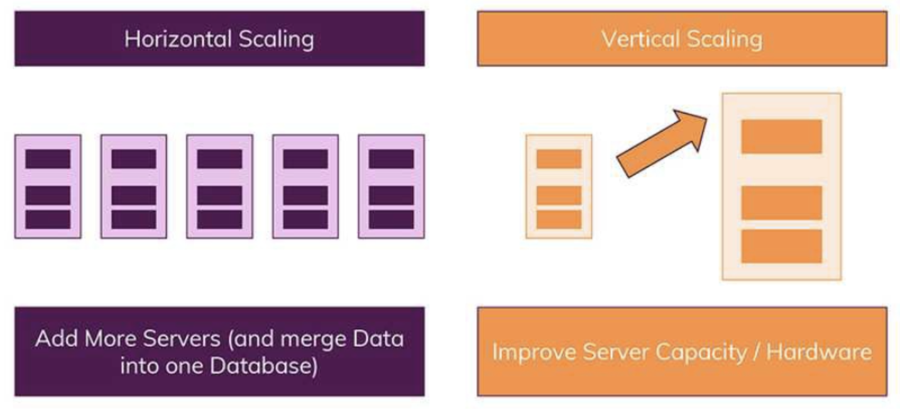
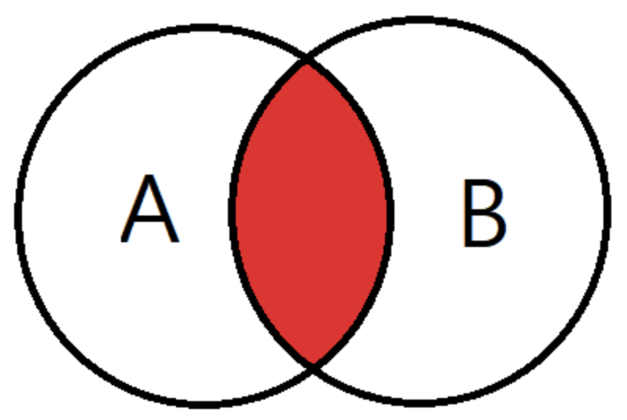
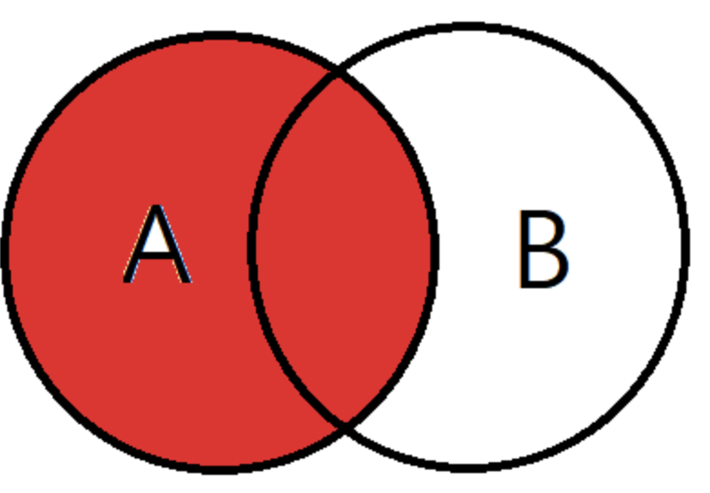
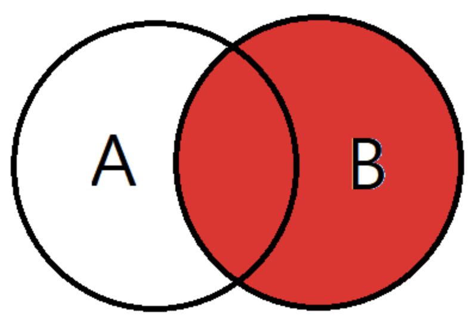
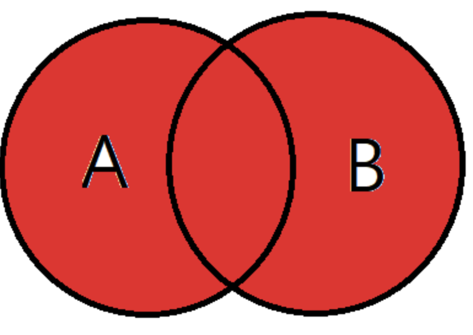
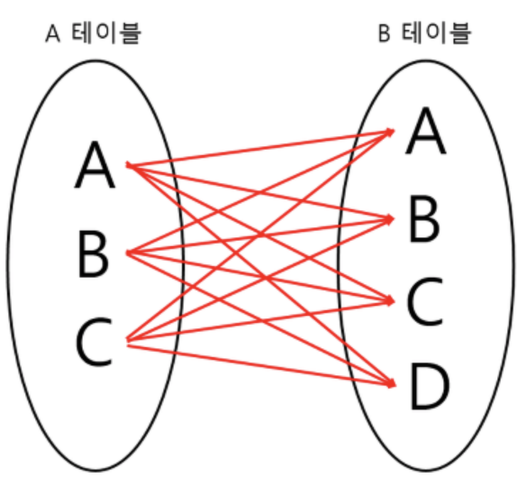
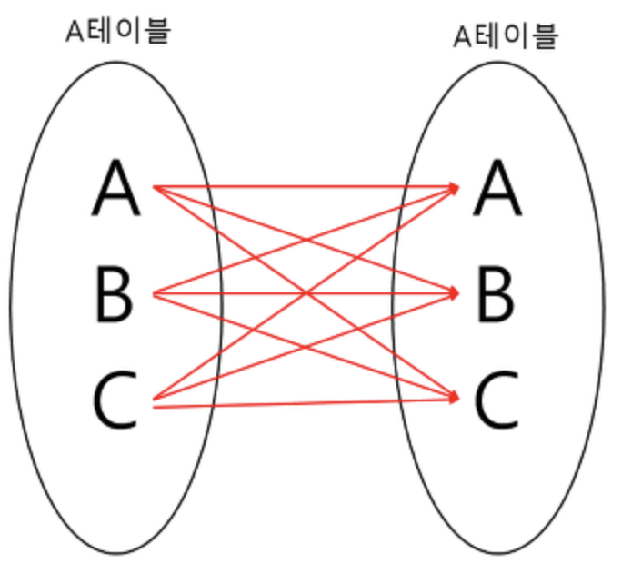

[TOC]

# Data Base

## 1. MySQL :vs: NoSQL

### 1) MySQL (관계형 데이터베이스)

- SQL => Structured Query Language, 데이터베이스와 상호작용 하는데 사용하는 쿼리 언어 

- 관계형 데이터베이스 특징

  - 데이터는 정해진(엄격한) 데이터 스키마를 따라 데이터베이스 테이블에 저장된다.
  - 데이터는 관계를 통해서 연결된 여러개의 테이블에 분산된다.

  

> 1. **엄격한 스키마**
>
> - 데이터는 테이블에 레코드로 저장, 각 테이블에는 명확하게 정의된 구조가 있음. 
>   - 구조란 어떤 데이터가 테이블에 들어가고 어떤 데이터가 그렇지 않을지를 정의하는 필드 집합 
>   - 구조는 필드의 이름과 데이터 유형으로 정의
> - 관계형 데이터베이스에서 스키마를 준수하지 않는 레코드는 추가할 수 없음. 
>
> 
>
> 2. **관계**
>
> - 데이터들을 여러개의 테이블에 나누어서, 데이터들의 중복을 피할 수 있음. 
> - 다른 테이블에서 부정확한 데이터를 다룰 위험이 없다는 장점


### 2) NoSQL (비관계형 데이터베이스)

- SQL과 반대되는 접근 방식
  - 스키마 없음
  - 관계 없음
- 일반적으로 관련 데이터를 동일한 컬렉션에 넣는다. 
  - Orders 컬렉션에 Users나 Products 정보 또한 포함해서 저장이 가능
  - 여러 테이블/ 콜렉션 조인이 필요 없음. 
- 데이터가 중복되기 때문에 불안정한 단점 
  - 컬렉션 B에서 데이터를 수정하지 않았는데, A에서만 데이터를 업데이트 할 위험
  - 특정 데이터를 같이 사용하는 모든 컬렉션에서, 똑같은 데이터를 업데이트 수정되도록 해야한다.
- 조인을 사용할 필요가 없다는 큰 장점 
  - 자주 변경되지 않는 데이터 일때 더 큰 장점


### 3) 수직적(Vertical) & 수평적(Horizontal) 확장(Scaling)

> 1. **수직적 확장**
>    - 단순히 데이터베이스 서버의 성능을 향상시키는 것 
>    - ex ) CPU를 업그레이드 하는 방식
> 2. **수평적 확장**
>    - 더 많은 서버가 추가되고, 데이터베이스가 전체적으로 분산됨 
>    - 하나의 데이터베이스에서 작동하지만 여러 호스트에서 작동
>
> 
>
> *** SQL 데이터 베이스는 일반적으로 수직적 확장만을 지원 
>
> *** 수평적 확장은 NoSQL 데이터베이스에서만 가능 


### 4) 장/단점 정리

> #### 1. SQL 장점
>
> - 명확하게 정의 된 스키마, 데이터 무결성 보장 
> - 관계는 각 데이터를 중복없이 한번만 저장됨 
>
> #### 2. SQL 단점
>
> - 상대적 덜 유연, 데이터 스키마는 사전에 계획되고 알려져야 한다. (후에 수정은 불가능 할 수도 있다.)
> - 관계를 맺고 있기 때문에, JOIN문이 많은 매우 복잡한 쿼리가 만들어 질 수 있음
> - 대체로 수직정 확장만 가능, 즉, 어떤 시점에서(처리량과 관련하여) 성장 한계에 직면하게 됨


>#### 1. NoSQL 장점
>
>- 스키마가 없기 때문에 훨씬 유연, 즉, 언제든지 저장된 데이터 조정하고 새로운 필드 추가 가능 
>- 데이터는 애플리케이션이 필요로 하는 형식으로 저장됨, 데이터를 읽어오는 속도가 빨라짐
>- 수직 및 수평 확장이 가능, 데이터 베이스가 애플리케이션에서 발생시키는 모든 읽기/쓰기 요청을 처리할 수 있음
>
>#### 2. NoSQL 단점
>
>- 유연성 때문에, 데이터 구조 결정을 하지 못하고 미루게 될 수도 있음
>- 데이터 중복은 여러 컬렉션과 문서가 여러 개의 레코드가 변경된 경우 업데이트 해야 함
>- 데이터가 여러 컬렉션에 중복되어 있기 때문에, 수정해야 하는경우 모든 컬렉션에서 수행해야 함 


> #### SQL을 사용하면 좋은 경우 ? 
>
> - 관계를 맺고 있는 데이터가 자주 변경(수정)되는 애플리케이션일 경우
>
>   ( NoSQL 에서는 여러 컬렉션을 모두 수정해줘야 하기 때문에)
>
> - 변경될 여지가 없고, 명확한 스키마가 사용자와 데이터에게 중요한 경우


> #### NoSQL을 사용하면 좋은 경우?
>
> - 정확한 데이터 구조를 알 수 없거나 변경/ 확장 될 수 있는 경우
> - 읽기 처리를 자주 하지만, 데이터를 자주 변경하지 않는 경우 
> - 데이터 베이스를 수평적으로 확장해야 하는 경우 (막대한 양의 데이터를 다뤄야 하는 경우)


## 2. 정규화

> **데이터의 중복을 방지**하고자 보다 **효율적으로 데이터를 저장**하기 위해서 한다.
>
> 삽입, 삭제, 갱신 이상의 발생 가능성을 줄이기 위해 !  


#### 1) 제 1 정규화

> 반복 되는 속성을 제거한 뒤 모든 속성이 원자 도메인 만으로 되어 있는 정규형 


#### 2) 제 2 정규화

> 부분함수적 종속을 제거하여 완전 함수적 종속을 만족하는 정규형


** **함수적 종속**

> 애트리뷰트 X의 값 각각에 대하여 시간에 관계없이 항상 애트리뷰트 Y의 값이 오직 하나만 연관되어 있을 때, Y는 X애 함수 종속 :  X-> Y


** **부분 함수적 종속**

> 기본키의 일부에 대해서만 종속인 경우


** **완전 함수적 종속**

> 기본키 모두에 대해서 종속인 경우 


#### 3) 제 3 정규화

> 이행적 함수적 종속 관계를 제거하여 비이행적 함수 종속 관계를 만족하는 정규형


** 이행적 함수적 종속

>신청번호 -> 회원번호, 회원번호 -> 회원취미 인 경우 
>
>신청번호 -> 회원취미 는 이행적 함수적 종속 관계이다.
>
>따라서 회원번호, 회원취미 속성을 분리하면 신청 테이블은 비이행적 함수적 종속 상태가 된다. 


#### 4) BCNF

> 결정자가 후보키가 아닌 함수 종속 제거해서 모든 결정자가 후보키이어야 한다는 것


> X -> Y 에서 X : 결정자,  Y : 종속자
>
> 후보키 : (학번, 과목), (학번, 교수)
>
> 함수적 종속 : (학번, 과목) -> 교수, 교수 -> 과목
>
> 결정자 : (학번, 과목), 교수 
>
> 여기서 교수는 결정자인데 후보키가 아니므로 교수 속성을 분리하면, 모든 결정자가 후보키이므로 BCNF를 만족한다.


#### 5) 제 4 정규화

> 다중값 종속 (=다치 종속) 제거 


** **다중값 종속 (=다치종속)**

> 1 : N 의 대응관계
>
> 하나의 아이디는 여러 개의 과목을 수강할 수 있음, 아이디와 수강과목은 다치 종속
>
> 다치 종속은 이상이 발생할 수 있으므로 분해 (무손실 분해) 되어야 하고, 이것을 4정규형 이라고 한다. 
>
> **무손실 분해** : 분해 이후에도 의미 있는 연결은 유지되어야 한다. 


#### 6) 제 5 정규화

> 조인 종속이 후보키를 통해서만 성립되는 정규형 


###  반정규화

> 정규화된 데이터 모델이 시스템의 성능 향상, 개발 과정의 편의성, 운영의 단순화를 목적으로 수행되는 의도적인 정규화 원칙 위배 행위
>
> -> 데이터 모델을 중복(추가), 통합(병합), 분리(분할) 하는 과정 


## 3. 이상 (Anomaly)

>정규화를 해야하는 이유는 잘못된 테이블 설계로 인해 Anomaly (이상 현상)가 나타나기 때문이다.


### 1) 삽입 이상(Insertion Anomaly)

> 기본키가 {Student ID, Course ID}인 경우 -> Course를 수강하지 않은 학생은 Course ID가 없는 현상이 발생함. 결국 Course ID를 Null로 할 수밖에 없는데, 기본키는 Null이 될 수 없으므로, table에 추가될 수 없음.
>
> 굳이 삽입하기 위해서는 '미수강'과 같은 Course ID를 만들어야 한다.

=> 불필요한 데이터를 추가해야지만, 삽입을 할 수 있는 상황 = Insertion Anomaly


### 2) 갱신 이상 (Update Anomaly)

> 만약 어떤 학생의 전공 (Department)이 "컴퓨터에서 음악"으로 바뀌는 경우 
>
> 그 학생과 관련된 모든 Department를 음악으로 바꾸어야 한다. 그러나 일부를 깜빡하고 바꾸지 못하는 경우, 제대로 파악하지 못한다.

=> 일부만 변경하여, 데이터가 불일치 하느 모순의 문제 = Update Anomaly


### 3) 삭제 이상 (Deletion Anomaly)

> 만약 어떤 학생이 수강을 철회하는 경우, {Student ID, Course ID, Department, Course ID, Grade}의 정보 중
>
> Student ID, Department 와 같은 학생에 대한 정보도 함께 삭제 된다.

=> 튜플 삭제로 인해 꼭 필요한 데이터까지 함께 삭제 되는 문제 = Deletion Anomaly


## 4. Key 

> Key : 검색, 정렬시 Tuple을 구분할 수 있는 기준이 되는 Attribute.


### 1). Candidate Key (후보키)

> Tuple을 유일하게 식별하기 위해 사용하는 속성들의 부분 집합. (기본키로 사용할 수 있는 속성들)

- 유일성 : Key로 하나의 Tuple을 유일하게 식별할 수 있다.
- 최소성 : 꼭 필요한 속성으로만 구성


### 2) Primary Key (기본키)

> 후보키 중 선택한 Main key

- Null을 가질 수 없다.
- 동일한 값이 중복될 수 없다.


### 3) Alternate Key (대체키)

> 후보키 중 기본키를 제외한 나머지 키 = 보조키


### 4) Super Key (슈퍼키)

> 유일성은 만족하지만, 최소성은 만족하지 못하는 키


## 5. SQL - JOIN

> 조인이란 ?
>
> 두 개이상의 테이블이나 데이터 베이스를 연결하여 데이터를 검색하는 방법

테이블을 연결하려면, 적어도 하나의 칼럼을 서로 공유하고 있어야 하므로 이를 이용하여 데이터 검색에 활용한다.


### 1) INNER JOIN



> 교집합, 기준 테이블과 join 테이블의 중복된 값을 보여준다.

```sql
SELECT
A.NAME, B.AGE
FROM EX_TABLE A
INNER JOIN JOIN_TABLE B ON A.NO_EMP = B.NO_EMP
```


### 2) LEFT OUTER JOIN



> 기준 테이블 값과 조인 테이블과 중복된 값을 보여준다.
>
> 왼쪽 테이블을 기준으로 JOIN을 한다고 생각하면 편하다.

```sql
SELECT
A.NAME, B.AGE
FROM EX_TABLE A
LEFT OUTER JOIN JOIN_TABLE B ON A.NO_EMP = B.NO_EMP
```


### 3) RIGHT OUTER JOIN



> 오른쪽 테이블 기준으로 JOIN

```sql
SELECT
A.NAME, B.AGE
FROM EX_TABLE A
RIGHT OUTER JOIN JOIN_TABEL B ON A.NO_EMP = B.NO_EMP
```


### 4) FULL OUTER JOIN



> 합집합, A와 B 테이블의 모든 데이터가 검색된다.

```sql
SELECT
A.NAEM, B.AGE
FROM EX_TABLE A
FULL OUTER JOIN JOIN_TABLE B ON A.NO_EMP = B.NO_EMP
```


### 5) CROSS JOIN



> 모든 경우의 수를 전부 표현해주는 방식
>
> A가 3개, B가 4개면 총 3*4 = 12개의 데이터가 검색된다.

```sql
SELECT
A.NAME, B.AGE
FROM EX_TABLE A
CROSS JOIN JOIN_TABEL B
```


### 6) SELF JOIN



> 자기 자신과 조인하는 것 
>
> 하나의 테이블을 여러 번 복사해서 조인한다고 생각하면 편하다.
>
> 자신이 갖고 있는 칼럼을 다양하게 변형시켜 활용할 때 자주 사용한다.

```sql
SELECT
A.NAME, B.AGE
FROM EX_TABLE A, EX_TABLE B
```


## 6. SQL Injection

> 해커에 의해 조작된 SQL 쿼리문이 데이터 베이스에 그대로 전달되어 비정상적 명령을 실행시키는 공격 기법


### 1) 공격 방법

#### 1. 인증 우회

보통 로그인을 할 때, 아이디와 비밀번호를 Input창에 입력하게 된다. 쉽게 이해하기 위해 가벼운 예를 들어보자. 아이디가 abc, 비밀번호가 1234일 때 쿼리는 아래와 같은 방식으로 전송될 것 이다.

```sql
SELECT * FROM USER WHERE ID = "abc" AND PASSWORD = "1234";
```

SQL Injection으로 공격할 때, input 창에 비밀번호를 입력함과 동시에 다른 쿼리문을 함께 입력하는 것이다.

```sql
1234; DELETE * USER FROM ID = "1";
```

보안이 완벽하지 않은 경우, 이처럼 비밀번호가 아이디와 일치해서 True가 되고 뒤에 작성한 DELETE문도 데이터베이스에 영향을 줄 수도 있게 되는 치명적인 상황이다.

이 밖에도 기본 쿼리문의 WHERE 절에 OR문을 추가하여 `'1' = '1'`과 같은 true문을 작성하여 무조건 적용되도록 수정한 뒤 DB를 마음대로 조작할 수도 있다.


#### 2. 데이터 노출

시스템에서 발생하는 에러 메시지를 이용해 공격하는 방법이다. 보통 에러는 개발자가 버그를 수정하는 면에서 도움을 받을 수 있는 존재다. 해커들은 이를 역이용해 악의적인 구문을 삽입하여 에러를 유발시킨다.

즉 예를 들면, 해커는 GET 방식으로 동작하는 URL 쿼리 스트링을 추가하여 에러를 발생시킨다. 이에 해당하는 오류가 발생하면, 이를 통해 웹앱의 데이터베이스 구조를 유추할 수 있고 해킹에 활용한다.


### 2) 방어 방법

#### 1. Input 값을 받을 때, 특수문자 여부 검사하기.

> 로그인 전, 검증 로직을 추가하여 미리 설정한 특수 문자들이 들어왔을 때 요청을 막아낸다.


#### 2. SQL 서버 오류 발생 시, 해당하는 에러 메시지 감추기

> view를 활용하여 원본 데이터베이스 테이블에는 접근 권한을 높인다. 일반 사용자는 view로만 접근하여 에러를 볼 수 없도록 만든다.


#### 3. preparestatement 사용하기

> preparestatement를 사용하면, 특수문자를 자동으로 escaping 해준다. (statement와는 다르게 쿼리문에서 전달인자 값을 `?`로 받는 것) 이를 활용해 서버 측에서 필터링 과정을 통해서 공격을 방어한다.


## 7. Index (인덱스)

> RDBMS에서 검색 속도를 높이기 위한 기술
>
> => 데이터 베이스 안의 레코드를 처음부터 풀스캔 하지 않고, B+ Tree로 구성된 구조에서 Index 파일 검색으로 속도를 향상시키는 기술 


### 1) 파일 구성

테이블 생성 시, 3가지 파일이 생성된다.

- FRM : 테이블 구조 저장 파일
- MYD : 실제 데이터 파일
- MYI : Index 정보 파일 (index 사용 시 생성)

사용자가 쿼리를 통해 Index를 사용하는 칼럼을 검색하게 되면, 이때 MYI 파일의 내용을 활용한다.


### 2) 단점

- Index 생성 시, .mdb 파일 크기가 증가한다.
- 한 페이지를 동시에 수정할 수 있는 병행성이 줄어든다. 
- 인덱스 된 Field에서 Data를 업데이트하거나, Record를 추가 또는 삭제시 성능이 떨어진다.
- 데이터 변경 작업이 자주 일어나는 경우, index를 재작성해야 하므로 성능에 영향을 미친다.


### 3) 상황 분석

- 사용하면 좋은 경우 

  - Where 절에서 자주 사용되는 컬럼
  - 외래키가 사용되는 컬럼
  - Join에 자주 사용되는 컬럼

  

- Index 사용을 피해야 하는 경우

  - Data 중복도가 높은 컬럼
  - DML이 자주 일어나는 컬럼

  

- DML이 일어났을 때 상황 

  1) INSERT

  - 기존 Block에 여유가 없을 때, 새로운 Data가 입력된다.
  - 새로운 Block을 할당 받은 후, Key를 옮기는 작업을 수행한다.
  - Index split 작업 동안, 해당 Block의 Key 값에 대해서 DML이 블로킹 된다 (대기 이벤트 발생)

  

  2) DELETE

  - Table에서 data가 delete 되는 경우 : data가 지워지고, 다른 data가 그 공간 사용 가능

  - Index에서 data가 delete 되는 경우 : data가 지워지지 않고, 사용 안 됨 표시만 해둠

  - Table의 data 수와 index의 data 수가 다를 수 있음.

    

  3) UPDATE

  - Table에서 update가 발생하면 Index는 update 할 수 없다.
  - Index에서는 Delete가 발생한 후, 새로운 작업의 Insert 작업 / 2배의 작업이 소요되어 힘들다.