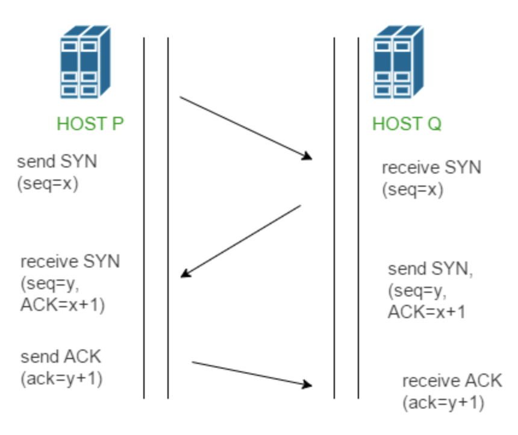
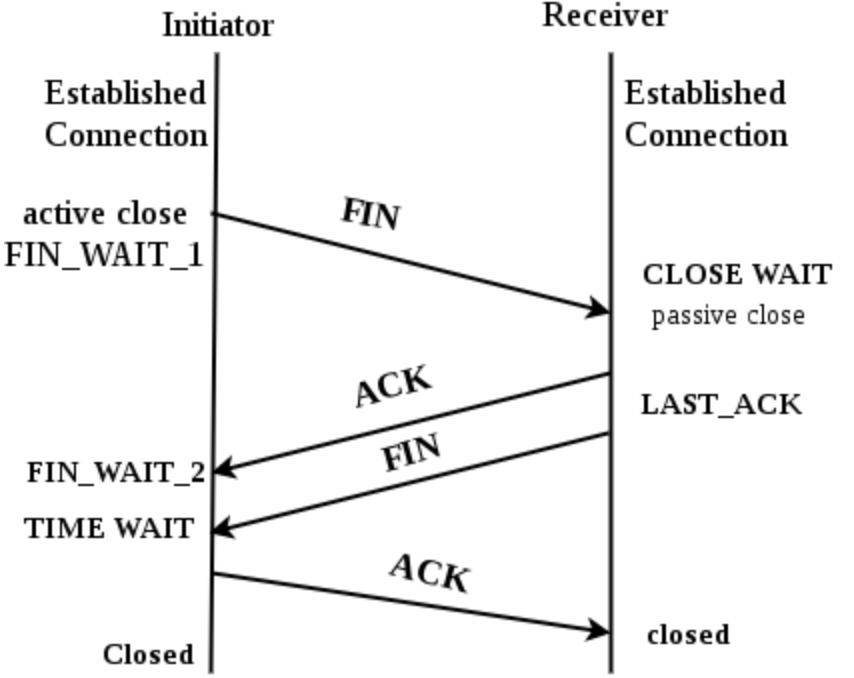
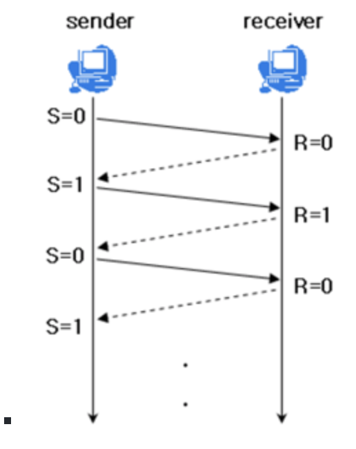
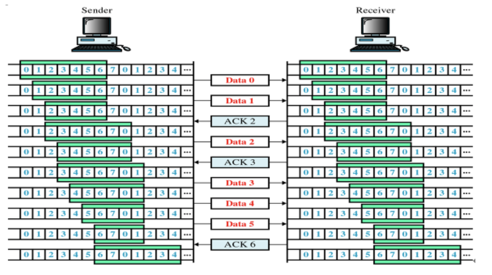
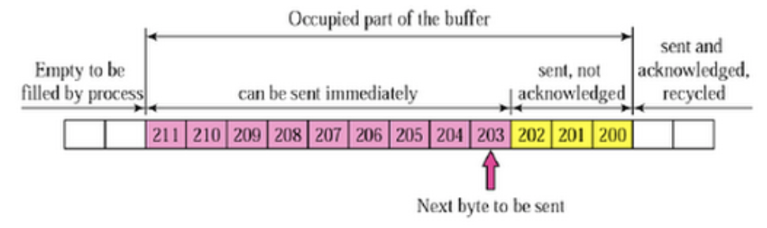
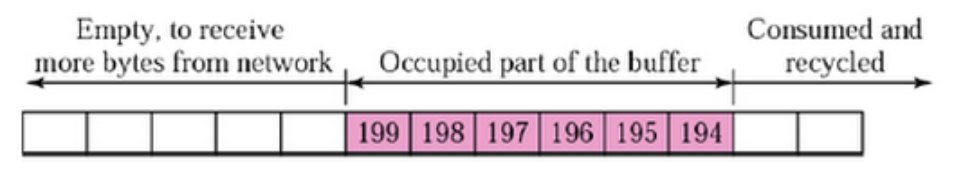
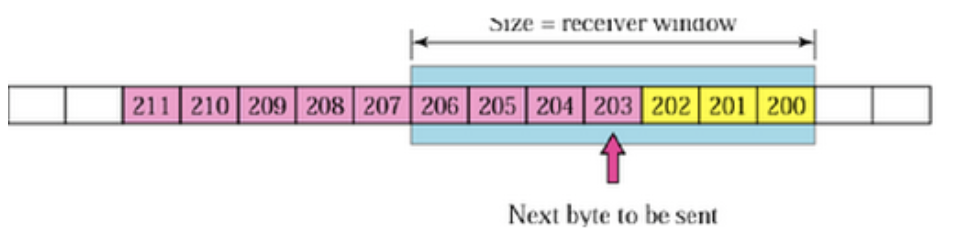
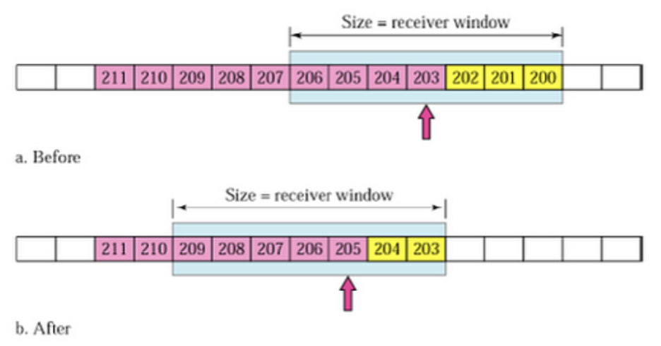
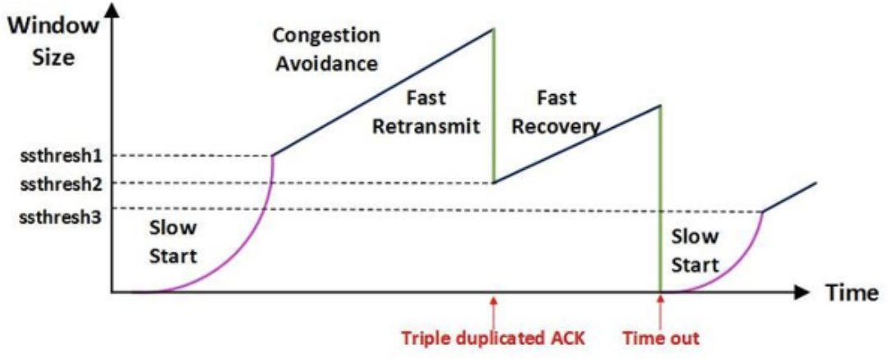
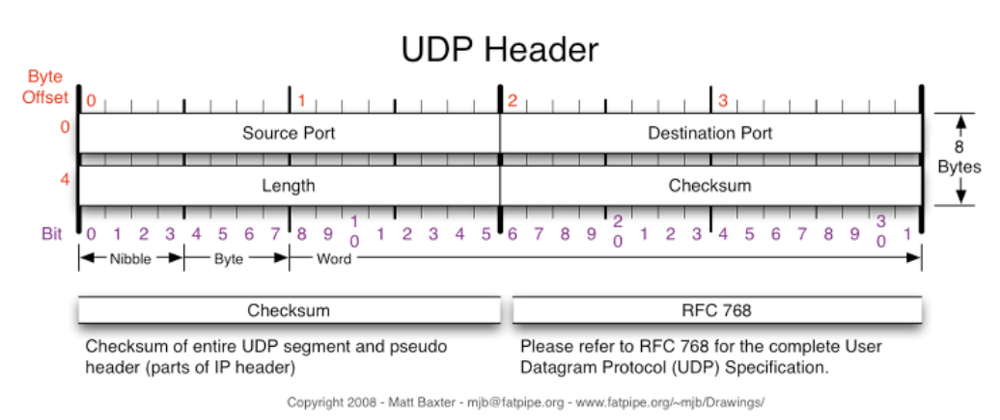

[TOC]

# Network

## 1. POST & GET 

#### 1) GET

> 서버에서 어떤 데이터를 가져와서 보여줄 때 사용
>
> 어떤 값이나 내용, 상태 등을 바꾸지 않는 경우에 사용.

입력한 정보가 url에 노출되고, 정보를 보여줘도 상관없는 기능을 수행할 때 get 메소드 수행 

** get 메소드 특징

> - 한번의 데이터 요청 시, 전송 데이터의 양은 주소값 + 파라미터로 255자 제한
>
> - 저장된 데이터를 단순히 요청할 때 사용
>
> - URL에 그대로 쿼리의 이름과 값이 같이 연결되어서 표현된다.
>
>   > http://사이트주소/블라블라?name=홍길동

#### 2) POST

> 서버상의 데이터 값이나 상태를 바꾸기 위해서 사용

입력한 정보를 숨겨서 로그인 상황이나, 중요한 데이터를 보내는 상황에서 post 메소드 수행 

데이터를 작성하거나 수정해서 요청하는 기능을 수행할 때에도 post 

** post 메소드 특징

> - 요청 시 데이터 양의 제한이 없다.
> - url상에 나타나지 않아서 보안 상 좋다.
> - request body에 담아서 보낸다 ! !

#### 3) Query

> 웹 서버에 특저안 정보를 보여달라는 웹 클라이언트 요청에 의한 처리 

#### 4) HTTP 패킷

> 웹에서 get과 post 방식으로 서버로 요청을 했을 때, 보내는 데이터를 http 패킷이라고 표현
>
> http 프로토콜을 사용하므로, 앞에 http가 붙고 인터넷을 통해 보내는 데이터를 패킷이라고 표현하기 때문 !
>
> HTTP 패킷 구조는 크게 헤더와 바디로 나누어져 있다.

** HTTP Method 

>- GET - 특정 리소스의 표시를 요청, 오직 데이터를 받아오기만 한다.
>- HEAD - GET 메서드와 동일한 응답을 요구하지만, 응답 본문을 포함하지 않는다.
>- POST - 특정 리소스에 엔티티를 제출할 때 사용, 서버 상태의 변화나 부작용 일으킨다.
>- PUT - 목적 리소스로 모든 현재 표시를 요청 payload로 바꾼다. 
>- DELETE - 특정 리소스를 삭제 
>- CONNECT - 목적 리소스로 식별되는 서버로의 터널을 맺는다. 
>- OPTIONS - 목적 리소스의 통신을 설정하는데 쓰인다.
>- TRACE - 목적 리소스의 경로를 따라 메시리 loop-back 테스트를 한다. 
>- PATCH - 리소스의 부분만을 수정하는데 쓰인다.

## 2. 프로세스 스케줄링 (CPU 스케줄링)

### 1. 비선점 스케줄링 : 비효율적, 비양보

#### 1) FIFO

> 도착한 순서에 따라 CPU 할당 

#### 2) SJF

> 실행 시간 추정치가 가장 작은 작업을 먼저 실행 
>
> 실행 시간이 큰 작업은 무한 연기 가능성 -> 강제 우선순위 부여하여 해결 

#### 3) HRN 

> 우선순위 = (대기시간+서비스시간)/서비스시간
>
> 우선순위 높은 순서대로 실행

### 2. 선점 스케줄링 : 효율적

#### 1) RR

> 할당 시간을 정해놓고, 할당되는 시간만큼 돌아가면서 작업 

#### 2) SRT

> 현재 실행중인 프로세스의 남은 시간과 준비상태 큐에 새로 도착한 프로세스의 실행 시간을 비교하여 가장 짧은 실행 시간을 요구하는 프로세스에게 CPU를 할당하는 기법

### 3. 클라우드

> 인터넷 기반에서 구동되는 컴퓨팅 기술

#### 1) Saas

> 소프트웨어를 웹에서 쓸 수 있음

#### 2) Iaas

> 서버와 스토리지, 네트워크 장비 등의 IT 인프라를 빌려줌 

#### 3) Paas

> 플랫폼을 빌려줌 

### 4. 네트워크

> 정보를 원하는 수신자 또는 기기에 정확하게 전송하기 위한 기반 인프라 
>
> 정보 전달 시에는 약속한 규칙에 따라야 하는데 이를 프로토콜이라고 한다. 

#### 1) 거리에 따른 네트워크 분류

- LAN (근거리 네트워크)

  : 구내나 동일 건물 내에서 프로그램, 파일 또는 주변 장치 등 자원을 공유할 수 있는 컴퓨터 통신망

- WAN (광대역 네트워크)

  : 각기 다른 LAN을 통합시켜 관련이 있는 기관과 상호 연결 시킨 광역 통신망

#### 2) 네트워크 장비

> 하나 이상의 네트워크를 상호 연결하는 장비

#### 1] 허브 : 1계층 장비

> 여러 대의 컴퓨터를 연결하여 네트워크로 보내거나 하나의 네트워크로 수신된 정보를 여러 대의 컴퓨터로 송신하기 위한 장비

#### 2] 리피터 : 1계층 장비

> 장거리 데이터 전송에서 신호를 증폭하는 장치

#### 3] 브리지, 스위치 : 2계층 장비

> 두 시스템을 연결하는 네트워킹 장치, 두 개의 LAN을 연결하여 훨씬 더 큰 LAN을 만들어줌
>
> 스위치는 하드웨어 기반으로 처리하여 속도가 빠르고, 포트들이 각기 다른 속도를 지원하도록 제어 할 수 있음. 
>
> 브리지는 소프트웨어 방식으로 처리해서 속도가 느리고, 포트들이 같은 속도를 지원 

#### 4] 라우터 : 3계층 장비

> 네트워크 계층에서 연결하여 경로를 설정하고 전달하는 기능을 제공하는 장비
>
> 라우팅 프로토콜 : 경로 설정을 하여 원하는 목적지까지 지정된 데이터가 안전하게 전달되도록 한다.

#### 5] 게이트웨이 : 4계층 장비

> 프로토콜이 전혀 다른 네트워크 사이를 결합
>
> 프로토콜 구조가 전혀 다른 외부 네트워크와 접속하기 위한 장비

** 라우팅 알고리즘

> 목적지까지 최적 경로를 산출하기 위한 법칙
>
> - 거리 벡터 알고리즘
>
>   : 라우터와 라우터 간의 거리, 방향 정보를 통해 최단 경로 찾고, 그 최적 경로 이용할 수 없을 경우 다른 경로 찾는다. 
>
>   프로토콜 종류 - RIP, IGRP
>
> - 링크 상태 알고리즘
>
>   : 라우터와 라우터 간의 모든 경로를 파악한 뒤 대체 경로를 사전에 마련해 두는 방식.
>
>   프로토콜 종류 - OSPF

### 5. 인터넷

** 백본

> 다른 네트워크 또는 같은 네트워크를 연결하여 그 중추 역할을 하는 네트워크

** 프로토콜

> 통신 시스템이 데이터를 교환하기 위해 사용하는 통신 규칙
>
> 프로토콜이 같아야만 통신할 수 있다. (응집도는 높게 결합도는 낮게)

** TCP / IP

> 서로 다른 기종의 컴퓨터들이 데이터를 주고 받을 수 있도록 하는 인터넷 표쥰 프로토콜

** DNS

> IP 주소와 호스트 이름 간의 변환을 제공하는 시스템 

### 6. 패킷 교환 방식

#### 1) 패킷

> 정보를 일정한 크기로 분할한 뒤 각각의 패킷에 송수신 주소 및 부가 정보를 입력한 것. 
>
> 현재 컴퓨터 네트워크에서 주로 사용하는 방식이다.

#### 2) 패킷 교환 방식

> 패킷이라는 단위를 사용하여 데이터를 송신하고 수신한다. 
>
> (송신) -> 메시지를 일정한 크기의 패킷으로 분해, 전송
>
> (수신) -> 패킷 재조립

- 가상 회선 방식 - 가상 경로를 설정해서 순서적으로 전달 (신뢰성 높음)
- 데이터그램 방식 - 주소, 패킷 번호를 포함해서 전송

## 3. OSI 7계층

> 다른 시스템 간의 원활한 통신을 위해 ISO에서 제안한 7단계 표준화 프로토콜

### 1. 물리계층

> 물리적인 연결 방식 (케이블), 매체간의 인터페이스
>
> 1계층 장비 : **리피터, 허브** 

### 2. 데이터 링크 계층

> 두 컴퓨터 간 데이터 통신 규정 (오류제어, 흐름제어)
>
> 2계층 장비 : **브리지, 스위치, 랜카드**

### 3. 네트워크 계층

> 여러 컴퓨터 간 데이터 통신 규정 (**경로 선택**, 교환 기술, 패킷 정보 전송) -> **IP**
>
> 3계층 장비 : **라우터**

### 4. 전송 계층

> 실제 전송을 하기 위한 규정 (**다중화, 주소 설정**)
>
> 종단 시스템 (end-to-end)간에 데이터 전송 가능 -> **TCP, UDP**
>
> 4계층 장비 : **게이트웨이**

### 5. 세션 계층

> 데이터 교환을 관리하기 위한 규정 (대화 제어)
>
> 5계층 장비 : PC

### 6. 표현 계층

> 데이텨 표현 규정 (**암호화**, 코드)
>
> 응용 계층에서 받은 데이터를 세션 계층에 보내기 전에 통신에 적당한 형태로 변환하고, 세션 계층에서 받은 데이터는 응용 계층에 맞게 변환 
>
> 6계층 장비 : PC

### 7. 응용 계층

> 사용자 프로그램
>
> 사용자가 OSI 환경에 접근할 수 있도록 서비스 제공
>
> 7계층 장비 : PC

## 4. 프로토콜 데이터 단위 (PDU)

- 물리 계층  - **bit** 
- 데이터 링크 계층 - **frame** : 블록 단위로 묶어서 전송되는 정보의 패키지 단위  
- 네트워크 계층 - **packet** 
- 전송 계층 - **segment** : 메시지를 작은 조각으로 분할
- 세션 계층, 표현 계층, 응용 계층 - **message** 

** OSI 7 레이어 별 전달 전보

- 세션 계층 - data
- 전송 계층 - data + TCP 헤더 
- 네트워크 계층 - data + TCP헤더 + IP헤더 
- 데이터링크 계층 - data + TC헤더P + IP헤더 + MAC주소 

** **TCP 헤더**

> 송수신자의 포트번호, 순서 번호, 응답 번호 등

** **IP 헤더**

> IP 버전과 전송지 IP, 목적지 IP, 프로토콜의 종류, 서비스 타입

** **MAC 주소**

> 통신을 위해 랜카드 등에 부여된 주소 (물리적 주소)

## 5. 프로토콜

> 컴퓨터 통신에서 컴퓨터 상호 간 또는 컴퓨터와 단말기 간에 데이터를 송,수신하기 위한 통신규약

### 1) 프로토콜 기본 요소

- **구문** - 데이터 형식
- **타이밍** - 순서, 속도 조절
- **의미** - 오류, 제어 정보

### 2) TCP/IP 프로토콜

> 서로 다른 기종의 컴퓨터들이 데이터를 주고 받을 수 있도록 하는 인터넷 표준 프로토콜

#### 1] 응용 계층 = 응용 계층 + 표현 계층 + 세션 계층

- SNMP (간이 망 관리 프로토콜)

  : 네트워크 장비를 관리 감시하기 위한 목적으로 UDP 상에 정의된 응용 계층 표준 프로토콜 

#### 2] 전송 계층 

- **TCP** ->  1:1

  : 가상 회선 연결 형태 -> 신뢰성, 안정성 높음

  패킷의 다중화, 순서 제어, 오류 제어, 흐름 제어 기능 

- **UDP** -> 1:다

  : 비연결형 -> 신뢰성 낮지만 속도 높음

#### 3] 인터넷 계층 = 네트워크 계층

- **IP**

  : 데이터그램을 기반으로 하는 비연결형 서비스

  패킷 분해/조립, 주소 지정, 경로 선택 기능

- **ICMP**

  : TCP/IP에서 신뢰성 없는 IP를 대신하여 송신측으로 네트워크의 IP 상태 및 에러 메시지를 전달해주는 프로토콜

- **IGMP**

  : 로컬 네트워크 상에서 라우터와 호스트 간의 멀티캐스트 환경을 제공 -> 그룹 관리를 위한 프로토콜

## 6. 3-way handshake & 4-way handshake

> 연결을 성립하고 해제하는 과정을 말한다.

### 1) 3-way handshake - 연결 성립

> TCP는 정확한 전송을 보장해야 한다. 따라서 통신하기에 앞서, 논리적인 접속을 성립하기 위해 3 way handshake 과정을 진행한다.

1. 클라이언트가 서버에게 SYN 패킷을 보낸다. (sequence : x)

2. 서버가 SYN(x)를 받고, 클라이언트로부터 받았다는 신호인 ACK와 SYN 패킷을 보낸다.

   (sequence : y, ACK : x+1)

3. 클라이언트는 서버의 응답인 ACK(x+1)와 SYN(y) 패킷을 받고, ACK(y+1)를 서버로 보낸다.

=> 이렇게 3번의 통신이 완료되면 연결이 성립된다. 

:question: SYN, ACK, NAK

> - SYN (Synchronized Sequence Number) - 연결 요청 플래그
> - ACK (Acknowledge) - 긍정 응답
> - NAK - 부정 응답 

### 2) 4-way handshake - 연결 해제

> 연결 성립 후, 모든 통신이 끝났다면 해제해야 한다.

#### 

1. 클라이언트는 서버에게 연결을 종료한다는 FIN 플래그를 보낸다.
2. 서버는 FIN을 받고, 확인했다는 ACK를 클라이언트에게 보낸다. (이때 모든 데이터를 보내기 위해 TIME OUT 상태가 된다)
3. 데이터를 모두 보냈다면, 연결이 종료되었다는 FIN 플래그를 클라이언트에게 보낸다.
4. 클라이언트는 FIN을 받고, 확인했다는 ACK를 서버에게 보낸다. (아직 서버로부터 받지 못한 데이터가 있을 수 있으므로, TIME_WAIT을 통해 기다린다.)
   - 서버는 ACK를 받은 이후 소켓을 닫는다. (closed)
   - TIME_WAIT 시간이 끝나면 클라이언트도 닫는다. (closed)

=> 이렇게 4번의 통신이 완료되면 연결이 해제된다.

** **ARQ(**Automatic Repeat reQuest, 자동 반복 요청)

> 통신 경로에서 오류 발생 시 수신측은 오류의 발생을 송신측에 통보하고 송신측은 오류가 발생한 프레임을 재 전송하는 오류 제어 방식 
>
> - **정지 대기 ARQ**
>
>   : 송신측은 하나의 블록을 전송, 수신측에서 에러 발생 점검 후 에러 발생 유무 신호 보내올 때까지 기다리는 방식 
>
>   (긍정 : ACK, 부정 : NAK)
>
> - **연속 ARQ > GO BACK N ARQ**
>
>   : 여러 블록을 연속적으로 전송하고 부정 응답 이후 모든 블록 재전송
>
> - **연속 ARQ > Selective Repeat ARQ**
>
>   : 여러 블록 연속적으로 전송하고 부정 응답이 있던 블록만 재전송
>
> - **적응적 ARQ**
>
>   : 동적 블록 -> 전송 효율 우수 -> 구현 복잡

## 7. TCP (흐름 제어/ 혼잡 제어)

- TCP 통신이란 ?
  - 네트워크 통신에서 신뢰적인 연결 방식
  - TCP는 기본적으로 unreliable network에서, reliable network를 보장할 수 있도록 하는 프로토콜
  - TCP는 network congestion avoidance algorithm을 사용
- reliabel network를 보장한다는 것은 4가지 문제점이 존재한다.
  - 손실 : packet이 손실될 수 있는 문제 
  - 순서 바뀜 : packet의 순서가 바뀌는 문제
  - Congestion : 네트워크가 혼잡한 문제
  - Overload : receiver가 overload 되는 문제
- 흐름제어 / 혼잡제어 란 ?
  - 흐름제어 (endsystem 대 endsystem)
    - 송신측과 수신측의 데이터 처리 속도 차이를 해결하기 위한 기법
    - flow control은 receiver가 packet을 지나치게 많이 받지 않도록 조절하는 것
    - 기본 개념은 receiver가 sender에게 현재 자신의 상태를 feedback 한다는 점
  - 혼잡 제어
    - 송신측의 데이터 전달과 네트워크의 데이터 처리 속도 차이를 해결하기 위한 기법
- 전송의 전체 과정
  - Application layer : sender application layer가 socket에 data를 쓴다.
  - Transport layer : data를 segment에 감싼다. 그리고 network layer에 넘겨준다.
  - 그러면 아랫단에서 어쨋든 receiving node로 전송이 됨. 이 때, sender의 send buffer에 data를 저장하고, receiver는 receive buffer에 data를 저장한다.
  - application에서 준비가 되면 이 buffer에 있는 것을 읽기 시작한다.
  - 따라서 flow control의 핵심은 이 receiver buffer가 넘치지 않게 하는 것.
  - 따라서 receiver는 RWND(Receive WINDOW) : receive buffer의 남은 공간을 홍보함 

### 1) 흐름 제어 (Flow Control)

- 수신측이 송신측보다 데이터 처리 속도가 빠르면 문제 없지만, 송신측의 속도가 빠를 경우 문제가 생긴다.

- 수신측에서 제한된 저장 용량을 초과한 이후에 도착하는 데이터는 손실 될 수 있으며, 만약 손실 된다면 불필요하게 응답과 데이터 전송이 송/수신 측 간에 빈번하게 발생한다.

- 이러한 위험을 줄이기 위해 송신 측의 데이터 전송량을 수신 측에 따라 조절해야 한다.

- 해결 방법

  - Stop and Wait : 매번 전송한 패킷에 대해 확인 응답을 받아야만 그 다음 패킷을 전송하는 방법

    

  - Sliding Window (Go Back N ARQ) :

    - 수신 측에서 설정한 윈도우 크기만큼 송신 측에서 확인 응답 없이 세그먼트를 전송할 수 있도록 하여 데이터 흐름을 동적으로 조절하는 제어 기법

    - 목적 : 전송은 되었지만, acked를 받지 못한 byte의 숫자를 파악하기 위해 사용하는 프로토콜

      LastByteSent - LastByteAcked <= ReceivecWindowAdvertised 

      (마지막에 보낸 바이트 - 마지막에 확인된 바이트 <= 남아있는 공간) == 

      (현재 공중에 떠있는 패킷 수 <= sliding window)

  - 동작 방식 : 먼저 윈도우에 포함되는 모든 패킷을 전송하고, 그 패킷들의 전달이 확인되는대로 이 윈도우를 옆으로 옮김으로써 그 다음 패킷들을 전송

    

  - WIndow : TCP/IP를 사용하는 모든 호스트들은 송신하기 위한 것과 수신하기 위한 2개의 window를 가지고 있다. 호스트들은 실제 데이터를 보내기 전에 '3 way handshaking'을 통해 수신 호스트의 receive window size에 자신의 send window size를 맞추게 된다.

  - 세부 구조 

    1) 송신 버퍼

    

    - 200 이전의 바이트는 이미 전송되었고, 확인 응답을 받은 상태

    - 200 ~ 202 바이트는 전송되었으나 확인 응답을 받지 못한 상태

    - 203 ~ 211 바이트는 아직 전송이 되지 않은 상태

      

    2) 수신 윈도우

    

    - 200 이전의 바이트 받은 상태 ?

      

    3) 송신 윈도우

    

    - 수신 윈도우보다 작거나 같은 크기로 송신 윈도우를 지정하게 되면 흐름제어가 가능함

      

    4) 송신 윈도우 이동 

    

    - Befor : 203 ~ 204를 전송하면 수신측에서는 확인 응답 203을 보내고, 송신측은 이를 받아 after 상태와 같이 수신 윈도우를 203~209 범위로 이동 
    - after : 205~209가 전송 가능한 상태

### 2) 혼잡 제어 (Congestion Control)

- 송신측의 데이터는 지역망이나 인터넷으로 연결된 대형 네트워크를 통해 전달된다. 만약 한 라우터에 데이터가 몰릴 경우, 자신에게 온 데이터를 모두 처리할 수 없게 된다. 이런 경우 호스트들은 또 다시 재전송을 하게 되고, 결국 혼잡만 가증시켜 오버플로우나 데이터 손실을 발생시키게 된다. 따라서 이러한 네트워크의 혼잡을 피하기 위해 송신측에서 보내는 데이터의 전송 속도를 강제로 줄이게 되는데, 이러한 작업을 혼잡 제어라고 한다.

- 또한 네트워크 내에 패킷의 수가 과도하게 증가하는 현상을 혼잡이라 하며, 혼잡 현상을 방지하거나 제거하는 기능을 혼잡제어라고 한다.

- 흐름제어가 송신측과 수신측 사이의 전송 속도를 다루는데 반해, 혼잡 제어는 호스트와 라우터를 포함한 보다 넓은 관점에서 전송 문제를 다루게 된다. 

- 해결 방법

  

  - AIMD (Additive Increase / Multiplicative Decrease)
    - 처음에 패킷을 하나씩 보내고 이것이 문제없이 도착하면 window 크기 (단위 시간 내에 보내는 패킷의 수)를 1씩 증가시켜가며 전송하는 방법
    - 패킷 전송에 실패하거나 일정 시간을 넘으면 패킷의 보내는 속도를 절반으로 줄인다. 
    - 공평한 방식으로, 여러 호스트가 한 네트워크를 공유하고 있으면 나중에 진입하는 쪽이 처음에는 불리하지만, 시간이 흐르면 평형상태로 수렴하게 되는 특징이 있다.
    - 문제점은 초기에 네트워크의 높은 대역폭을 사용하지 못하여 오랜 시간이 걸리게 되고, 네트워크가 혼잡해지는 상황을 미리 감지하지 못한다. 즉, 네트워크가 혼잡해지고 나서야 대역폭을 줄이는 방법
  - Slow Start (느린 시작)
    - AIMD 방식이 네트워크의 수용량 주변에서는 효율적으로 작동하지만, 처음에 전송 속도를 올리는데 시간이 오래 걸리는 단점이 존재
    - Slow Start 방식은 AIMD와 마찬가지로 패킷을 하나씩 보내면서 시작, 패킷이 문제없이 도착하면 각각의 ACK 패킷마다 window size를 1씩 늘려준다. 즉, 한 주기가 지나면 window size가 2배로 된다. 
    - 전송 속도는 AIMD에 반해 지수 함수 꼴로 증가한다. 대신에 혼잡 현상이 발생하면 window size를 1로 떨어뜨리게 된다.
    - 처음에는 네트워크의 수용량을 예상할 수 있는 정보가 없지만, 한 번 혼잡 현상이 발생하고 나면 네트워크의 수용량을 어느 정도 예상할 수 있다.
    - 그러므로 혼잡 현상이 발생하였던 window size의 절반까지는 이전처럼 지수 함수 꼴로 창 크기를 증가시키고 그 이후부터는 완만하게 1씩 증가시킨다.
  - Fast Retransmit (빠른 재전송)
    - 빠른 재전송은 TCP의 혼잡 조절에 추가된 정책이다.
    - 패킷을 받는 쪽에서 먼저 도착해야 할 패킷이 도착하지 않고, 다음 패킷이 도착한 경우에도 ACK 패킷을 보내게 된다.
    - 단, 순서대로 잘 도착한 마지막 패킷의 다음 패킷의 순번을 ACK 패킷에 실어서 보내게 되므로, 중간에 하나가 손실되게 되면 송신 측에서는 순번이 중복된 ACK 패킷을 받게 된다. 이것을 감지하는 순간 문제가 되는 순번의 패킷을 재전송 해줄 수 있다.
  - Fast Recovery (빠른 회복)
    - 혼잡한 상태가 되면 window size를 1로 줄이지 않고 반으로 줄이고, 선형 증가 시키는 방법. 이 정책까지 적용하면 혼잡 상황을 한 번 겪고 나서부터는 순수한 AIMD 방식으로 동작하게 된다. 

## 8. UDP

> :question: UDP 통신이란 
>
> - User Datagram Protocol의 약자로 데이터를 데이터그램 단위로 처리하는 프로토콜 
> - 비연결형, 신뢰성 없는 전송 프로토콜
> - 데이터그램 단위로 쪼개면서 전송을 해야하기 때문에 전송 계층이다
> - Transport layer에서 사용하는 프로토콜

- TCP와 UDP는 왜 나오게 됐는가?

  1) IP의 역할은 Host to Host (장치 to 장치)만을 지원한다. 장치에서 장치로 이동은 IP로 해결되지만, 하나의 장비안에서 수많은 프로그램들이 통신을 할 경우에는 IP만으로는 한계가 있다.

  2) 또한 IP에서 오류가 발생한다면 ICMP에서 알려준다. 하지만 ICMP는 알려주기만 할 뿐 대처를 못하기 때문에 IP보다 위에서 처리를 해줘야 한다.

  - 1번을 해결하기 위해 포트 번호가 나오게 됐고, 2번을 해결하기 위해 상위 프로토콜인 TCP, UDP가 나오게 되었다.

** ICMP 

> 인터넷 제어 메시지 프로토콜, 네트워크 컴퓨터 위에서 돌아가는 운영체제에서 오류 메시지를 전송받는데 주로 쓰인다.

- TCP와 UDP가 어떻게 오류를 해결하는가?

  - TCP : 데이터의 분실, 중복, 순서가 뒤바뀜 등을 자동으로 분석해줘서 송수신 데이터의 정확한 전달을 할 수 있도록 해준다.

  - UDP : IP가 제공하는 정도의 수준만을 제공하는 간단한 IP 상위 계층 프로토콜, TCP와는 다르게 에러가 날 수 있고, 재전송이나 순서가 뒤바뀔 수도 있어서 이 경우, 애플리케이션에서 처리하는 번거로움이 존재한다.

    

- UDP는 왜 사용하나?

  - UDP의 결정적인 장점은 **데이터의 신속성**이다. 데이터 처리가 TCP보다 빠르다.

  - 주로 실시간 방송과 온라인 게임에서 사용된다. 네트워크 환경이 안 좋을때, 끊기는 현상을 생각하면 된다.

    

- DNS (Domain Name Service)에서 UDP를 사용하는 이유

  - Request의 양이 작음 -> UDP Request에 담길 수 있다.
  - 3 way handshaking으로 연결을 유지할 필요가 없다. (오버헤드 발생)
  - Request에 대한 손실은 Application Layer에서 제어가 가능
  - DNS : port 53번 
  - But, TCP를 사용할 때가 있다. 크기가 512(UDP 제한)이 넘을 때, TCP를 사용해야 한다.

### 1) UDP Header

#### 

> - Source Port : 시작 포트
> - Destination Port : 도착지 포트
> - Length : 길이
> - Checksum : 오류 검출  - 중복 검사의 한 형태로, 오류 정정을 통해 공간이나 시간 속에서 송신된 자료의 무결성을 보호하는 단순한 방법

- 이렇게 간단하기 때문에, TCP보다 용량이 가볍고 송신 속도가 빠르게 작동된다.
- 그러나 확인 응답을 못하므로, TCP보다 신뢰도가 떨어진다.
- UDP는 비연결성, TCP는 연결성으로 정의할 수 있다.

### 2) DNS는 UDP사용

> DNS는 데이터를 교환하는 경우이다.
>
> 이때, TCP를 사용하게 되면, 데이터를 송신할 때까지 세션 확립을 위한 처리를 하고, 송신한 데이터가 수신되었는지 점검하는 과정이 필요하므로, Protocol overhead가 UDP에 비해서 크다.

DNS는 Application layer protocol 이다.

모든 Application layer protocol은 TCP, UDP 중 하나의 Transport layer protocol을 사용해야 한다.

TCP reliable, UDP not reliable 인데 왜 UDP를 사용할까 ? 

- TCP 가 3-way handshake를 사용하는 반면, UDP는 connection을 유지할 필요가 없다.
- DNS request는 UDP segment에 들어갈 정도로 작다. 
- UDP는 not reliable이나, reliability는 application layer에 추가 될 수 있다. (time out 추가, resend 작업)

TCP를 사용하는 경우도 있다.

- Zone transfer을 사용해야 하는 경우에는 TCP

** Zone transfer

> DNS 서버 간의 요청을 주고 받을 때 사용하는 transfer 
>
> 만약에 데이터가 512 bytes를 넘거나, 응답을 못받은 경우에는 TCP로 한다. 

## 9. 대칭키 VS 공개키

### 1) 대칭키 (Symmetric Key)

> 암호화와 복호화에 같은 암호키(대칭키)를 사용하는 알고리즘

- 장점 : 동일한 키를 주고받기 때문에, 매우 빠르다.

- 단점 : 대칭키 전달 과정에서 해킹 위험에 노출 가능

### 2) 공개키 (Public Key)

> 암호화와 복호화에 사용하는 암호키를 분리한 알고리즘

- 장점 : 안전성 
- 단점 : 알고리즘이 복잡, 속도가 느리다 

:triangular_flag_on_post: 공개키 암호화 방식 진행 과정

1. A가 웹 상에 공개된 'B의 공개키'를 이용해 평문을 암호화하여 B에게 보냄
2. B는 자신의 비밀키로 복호화한 평문을 확인, A의 공개키로 응답을 암호화하여 A에게 보냄
3. A는 자신의 비밀키로 암호화 된 응답문을 복호화함 

(키가 서로 다르기 때문에 암호화 복호화가 매우 복잡하다. )

:triangular_flag_on_post: 대칭키와 공개키 암호화 방식을 적절하게 혼합해보면 ?

> SSL 탄생의 시초

1. A가 B의 공개키로 암호화 통신에 사용할 대칭키를 암호화하고 B에게 보낸다.
2. B는 암호문을 받고, 자신의 비밀키로 복호화 한다.
3. B는 A로부터 얻은 대칭키로 A에게 보낼 평문을 암호화하여 A에게 보낸다.
4. A는 자신의 대칭키로 암호문을 복호화 한다.
5. 앞으로 이 대칭키로 암호화를 통신한다. 

(즉, 대칭키를 주고 받을 때만 공개키 암호화 방식을 사용하고, 이후에는 계속 대칭키 암호화 방식으로 통신하는 것이다.)

## 10. HTTP & HTTPS

### 1) HTTP (HyperText Transfer Protocol)

> 인터넷 상에서 클라이언트와 서버가 자원을 주고 받을 때 쓰는 통신 규약

- HTTP는 텍스트 교환이므로, 누군가 네트워크에서 신호를 가로채면 내용이 노출되는 보안 이슈가 존재한다. 
- 이러한 보안 문제를 해결해주는 프로토콜이 'HTTPS'

### 2) HTTPS (HyperText Transfer Protocol Secure)

> 인터넷 상에서 정보를 암호화하는 SSL 프로토콜을 사용해 클라이언트와 서버가 자원을 주고 받을 때 쓰는 통신 규약

- HTTPS는 텍스트를 암호화한다. (공개키 암호화 방식으로)

:triangular_flag_on_post: **HTTPS 통신 흐름**

1. 애플리케이션 서버(A)를 만드는 기업은 HTTPS를 적용하기 위해 공개키와 개인키를 만든다.
2. 신뢰할 수 있는 CA 기업을 선택하고, 그 기업에게 내 공개키 관리를 부탁하며 계약을 한다.
3. 계약 완료된 CA 기업은 해당 기업의 이름, A서버 공개키, 공개키 암호화 방법을 담은 인증서를 만들고, 해당 인증서를 CA 기업의 개인키로 암호화해서 A서버에게 제공한다.
4. A서버는 암호화 된 인증서를 갖게 되었다. 이제 A서버는 A서버의 공개키로 암호화 된 HTTPS 요청이 아닌 요청이 오면, 이 암호화 된 인증서를 클라이언트에게 건내준다.
5. 클라이언트는 `main.html` 파일을 달라고 A 서버에 요청했다고 가정하자. HTTPS 요청이 아니기 때문에 CA 기업이 A 서버의 정보를 CA 기업의 개인키로 암호화한 인증서를 받게 된다.
6. 브라우저는 해독한 뒤 A 서버의 공개키를 얻게 되었다. 이제 A 서버와 통신할 때는 얻은 A 서버의 공개키로 암호화해서 요청을 날리게 된다. 

HTTPS도 무조건 안전한 것은 아니다. (신뢰받는 CA 기업이 아닌 자체 인증서 발급한 경우 등)

**CA**:question:

> Certificate Authority로, 공개키를 저장해주는 신뢰성이 검증된 민간 기업ㄴ