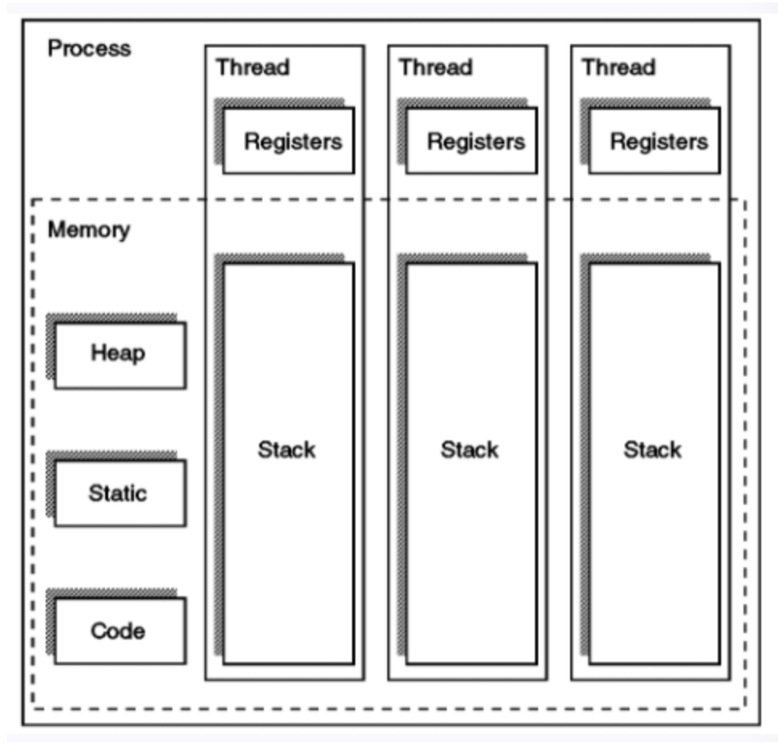

[TOC]

# OS

## 1. 운영체제

> 하드웨어를 관리하고, 응용 프로그램과 하드웨어 사이에서 인터페이스 역할을 하며 시스템의 동작을 제어하는 시스템 소프트웨어 

#### 1) 프로세스 관리

- 프로세스, 스레드
- 스케줄링
- 동기화
- IPC 통신

>  운영체제에서 작동하는 응용 프로그램을 관리하는 기능, 어떤 의미에서는 프로세서(CPU)를 관리하는 것으로 볼 수도 있다. 
>
>  현재 CPU를 점유해야 할 프로세스를 결정하고, 실제로 CPU를 프로세스에 할당, 이 프로세스 간 공유 자원 접근과 통신 등을 관리하게 된다.

#### 2) 저장장치 관리

- 메모리 관리
- 가상 메모리
- 파일 시스템

> 1차 저장장치에 해당하는 메인 메모리와 2차 저장장치에 해당하는 하드디스크, NAND 등을 관리하는 기능 
>
> - 1차 저장장치 - Main Memory
>   - 프로세스에 할당하는 메모리 영역의 할당과 해제
>   - 각 메모리 영역 간의 침범 방지
>   - 메인 메모리의 효율적 활용을 위한 가상 메모리 기능
> - 2차 저장장치 - HDD, NAND, Flash Memory
>   - 파일 형식의 데이터 저장
>   - 이런 파일 데이터 관리를 위한 파일 시스템을 OS에서 관리

#### 3) 네트워킹

- TCP / IP
- 기타 프로토콜

> 네트워킹은 컴퓨터 활용의 핵심
>
> TCP/IP 기반의 인터넷에 연결하거나, 응용 프로그램이 네트워트를 사용하려면 운영체제에서 네트워크 프로토콜을 지원해야 한다. 현재 상용 OS들은 다양하고 많은 네트워크 프로토콜 지원
>
> 이처럼 운영체제는 사용자와 컴퓨터 하드웨어 사이에 위치해서, 하드웨어를 운영 및 관리하고 명령어를 제어하여 응용 프로그램 및 하드웨어를 소프트웨어적으로 제어 및 관리를 해야 함

#### 4) 사용자관리

- 계정 관리
- 접근권한 관리

> 하나의 PC로도 여러 사람이 사용하는 경우가 많다. 그래서 운영체제는 한 컴퓨터를 여러 사람이 사용하는 환경도 지원해야 한다. 가족들이 각자의 계정을 만들어 PC를 사용한다면, 이는 하나의 컴퓨터를 여러 명이 사용한다고 말할 수 있다.
>
> 따라서, 운영체제는 각 계정을 관리할 수 있는 기능이 필요하다. 사용자 별로 프라이버시와 보안을 위해 개인 파일에 대해선 다른 사용자가 접근할 수 없도록 해야 한다. 이 밖에도 파일이나 시스템 자원 접근 권한을 지정할 수 있도록 지원하는 것이 사용자 관리 기능이다.

#### 5) 디바이스 드라이버

- 순차접근 장치
- 임의접근 장치
- 네트워크 장치

> 운영체제는 시스템의 자원, 하드웨어를 관리한다. 시스템에는 여러 하드웨어가 붙어있는데, 이들을 운영체제에서 인식하고 관리하게 만들어 응용 프로그램이 하드웨어를 사용할 수 있게 만들어야 한다. 
>
> 따라서, 운영체제 안에 하드웨어를 추상화 해주는 계층이 필요하다. 이 계층이 바로 디바이스 드라이버라고 불린다. 하드웨어의 종류가 많은 만큼, 운영체제 내부의 디바이스 드라이버도 많이 존재한다.
>
> 이러한 수 많은 디바이스 드라이버들을 관리하는 기능 또한 운영체제가 맡고 있다.

## 2. Thread란 ?

> - 쓰레드란 **프로그램(프로세스)의 실행 단위**, 하나의 프로세스는 여러개의 쓰레드로 구성이 가능
>
> - 하나의 프로세스를 구성하는 쓰레드들은 프로세스에 할당된 메모리, 자원 등을 공유
>
> - 프로세스와 같이 실행, 준비, 대기 등의 실행상태 가짐 
>
> - 각 쓰레드별로 자신만의 스택과 레지스터 가짐
>
>   
>
> - 한 순간에는 하나의 쓰레드만 실행 가능

#### 1) 프로세스와 쓰레드의 차이

> **프로세스** : 운영체제로부터 자원을 할당받는 작업의 단위
>
> - 프로세스는 실행 중인 프로그램으로 디스크로부터 메모리에 적재되어 CPU 할당을 받을 수 있는 것

> **쓰레드** : 프로세스가 할당받은 자원을 이용하는 실행의 단위
>
> - 한 프로세스 내에서 동작되는 여러 실행 흐름, 프로세스 내의 주소 공간이나 자원 공유
> - 각각의 쓰레드는 독립적인 작업 수행, 각각의 stack과 PC resister를 가지고 있다. 

> **스택을 쓰레드마다 독립적으로 할당하는 이유 ?**
>
> - 스택은 함수 호출 시 전달되는 인자, 되돌아갈 주소 값 및 함수 내에서 선언하는 변수 등을 저장하기 위해 사용되는 메모리 공간
> - 스택 메모리 공간이 독립적이라는 것은 독립적인 함수 호출이 가능하다는 것, 이는 독립적인 실행 흐름이 가능하다
> - 독립적인 실행 흐름을 위한 최소 조건으로 독립된 스택 할당

> **PB Resister를 쓰레드마다 독립적으로 할당하는 이유 ?**
>
> - PC 값은 쓰레드가 명령어의 어디까지 수행하였는지를 나타냄
> - 쓰레드는 CPU를 할당받았다가 스케줄러에 의해 다시 선점당함. 그렇기 때문에 명령어가 연속적으로 수행되지 못하고 어느 부분까지 수행했는지 기억할 필요가 있음.
> - 따라서 PC resister를 독립적으로 할당함. 

#### 2) 쓰레드의 장점

- 쓰레드는 프로세스보다 생성 및 종료 시간, 쓰레드 간 전환 시간이 짧다.
- 쓰레드는 프로세스의 메모리, 자원 등을 공유하므로 커널의 도움 없이 상호간에 통신이 가능하다. 

#### 3) 쓰레드 동기화 방법의 종류

- Mutex / semaphore / Monitor
  - 세가지 모두 운영체제의 동기화 기법

> **Mutex (Mutual Exclusion)**
>
> - 쓰레드의 동시 접근을 허용하지 않는다는 의미
> - 뮤텍스의 쓰레드 동기화 방법은 임계영역에 들어가기 위해 이 뮤텍스를 가지고 있어야 들어갈 수 있음

> **Semaphore**
>
> - 세마포어는 동시 접근 동기화가 아닌 접근 순서 동기화에 더 관련 있음

> **Monitor**
>
> - Mutex와 Queue을 가지고 있는 Synchronization 메카니즘

- Mutex, Monitor는 상호 배제, 임계 구역에 하나의 쓰레드만 들어갈 수 있다.
- Semaphore는 하나의 쓰레드만 들어가거나 여러 개의 쓰레드가 들어갈 수 있다

> **Mutex** Vs **Monitor**
>
> - 뮤텍스
>   - 뮤텍스는 다른 프로세스(애플리케이션)간에 동기화를 위해 사용
>   - 운영체제 커널에 의해서 제공
>   - 무겁고 느림
> - 모니터
>   - 모니터는 하나의 프로세스(애플리케이션)내에 다른 쓰레드 간에 동기화 할 때 사용 
>   - 프레임워크나 라이브러리 그 자체에서 제공
>   - 가볍고 빠르다

> **Semaphore** Vs **Monitor**
>
> - 세마포어
>   - 카운터라는 변수 값으로 프로그래머가 상호 배제나 정렬의 목적으로 사용시, 매번 값을 따로 지정해줘야함
> - 모니터
>   - 이러한 일들이 캡슐화, 개발자는 카운터값을 1 또는 0으로 주어야 하는 고민 필요없이 synchronized(), wait() 등의 키워드를 이용해 좀 더 편하게 동기화

> **Mutex** Vs **Semaphore**
>
> - 세마포어
>   - 세마포어는 소유할 수 없음
>   - 하나 이상 동기화 가능
> - 뮤텍스
>   - 소유 할 수 있음, 소유자가 이에 책임
>   - 1개만 동기화 

## 3. 데드락

> **데드락**이란?
>
> 프로세스가 자원을 얻지 못해 다음 처리를 하지 못하는 상태를 의미합니다. 시스템적으로 한정된 자원을 여러 곳에서 사용하려고 할 때 발생합니다. 해결 방법으로는 예방, 회피, 회복, 무시 등의 4가지 방법이 있습니다. 

> **예방**은 교착 상태가 일어나는 조건 (상호 배제, 점유와 대기, 비선점, 환형대기)이 발생하지 않도록 하나만 해결하는 것, 
>
> **회피**는 교착 상태의 발생 조건을 없애기 보다는 발생하지 않도록 알고리즘을 적용하는 방법, 
>
> **회복**은 교착상태가 발생하는 것을 막지는 않고, 발생하면 발생 이후에 문제를 해결하는 방법, 
>
> **무시**는 교착 상태를 해결할 때 발생하는 성능 저하가 더 크면 그냥 무시해버리는 것 

