# VirtualBox 이용하여 Linux 실습 환경 만들기

## 1. 리눅스

>리눅스(Linux)는 리누스 토발즈가 커뮤니티 주체로 유닉스(UNIX) 운영체제를 기반으로 만들어진 컴퓨터 운영체제입니다. 리눅스(Linux)는 유닉스(UNIX)와 마찬가지로 다중 사용자, 다중 작업(멀티태스킹), 다중 스레드를 지원하는 네트워크 운영 체제(NOS)입니다. 현재는 상당수의 웹 서버와 모바일 장치(안드로이드 등)를 구동하는 운영체제로도 많이 이용이 되고 있습니다.

### 1) 리눅스 사용 이유

- 모든 소스가 오픈되어 있어 광범위하게 사용
- 다중사용자, 다중작업 지원 / 시스템적으로 서버를 운영하기에 적합
- 무료, 개발 환경이 풍부

> 가상머신
>
> : 하드웨어를 소프트웨어적으로 구현해서 그 위에서 운영체제가 작동하도록하는 기술 

## 2. 세팅 순서

### 1) VirtualBox 설치

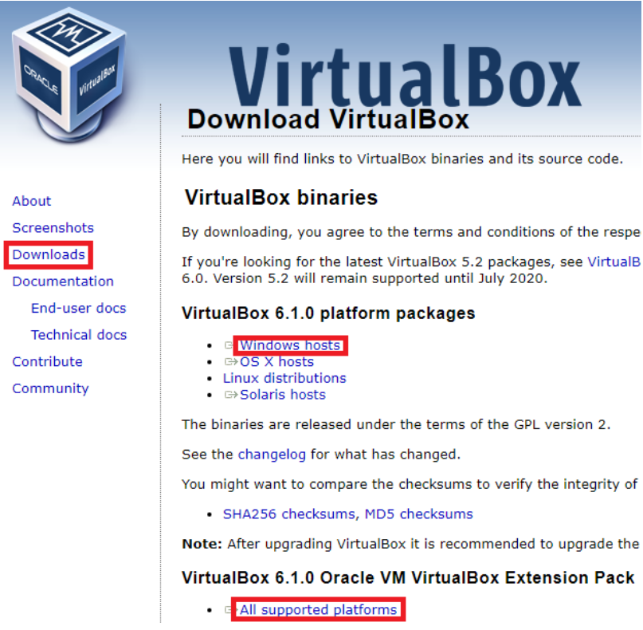

### 2) Ubuntu iso 다운로드

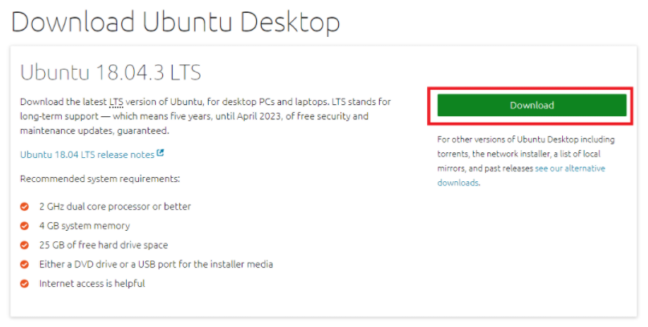

> ubuntu 검색한 후, Download Ubuntu Desktop 선택해서 설치

### 3) Virtual Box 실행

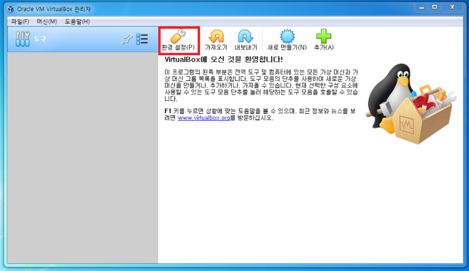

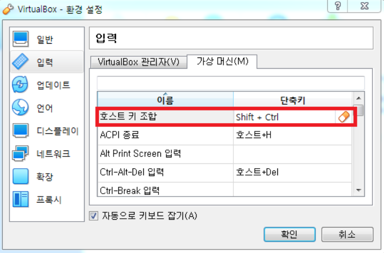

> 호스트 키 조합의 단축키 Right Control를 한글 윈도우에서는 동작하지 않기 때문에 **Shift+Ctrl**로 재설정합니다.

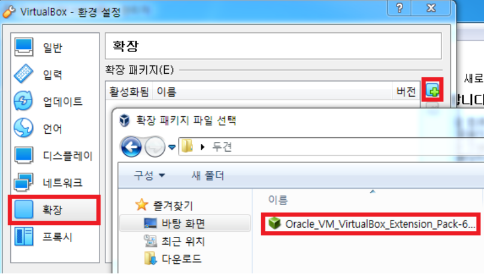

> 확장 기능 패키지 설치

### 4. Ubuntu 가상 머신 생성

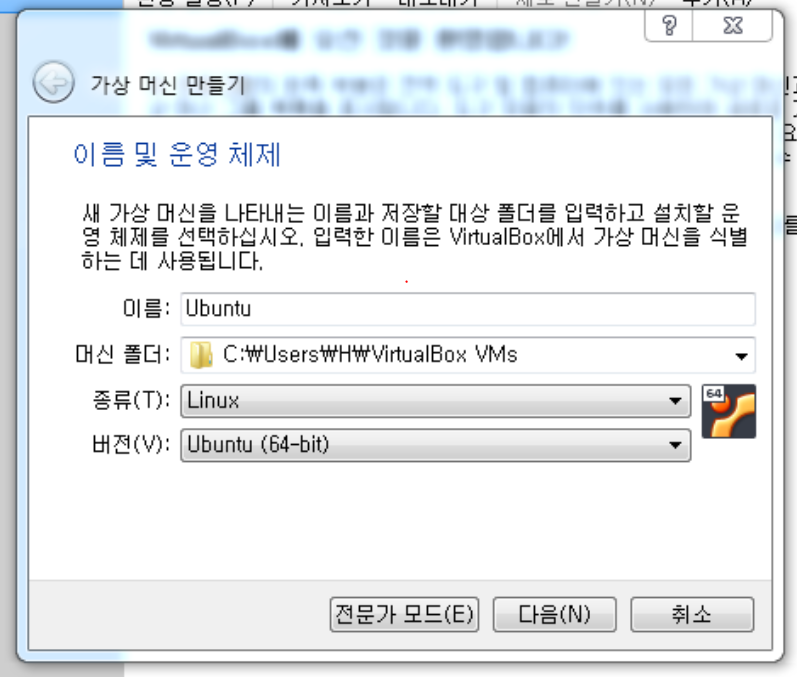

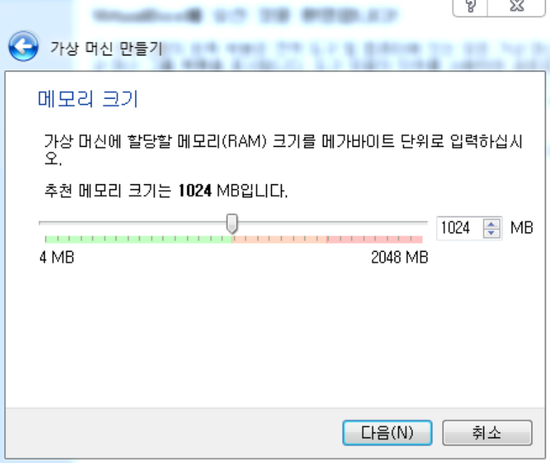

> 초록색 범위 내에서 선택

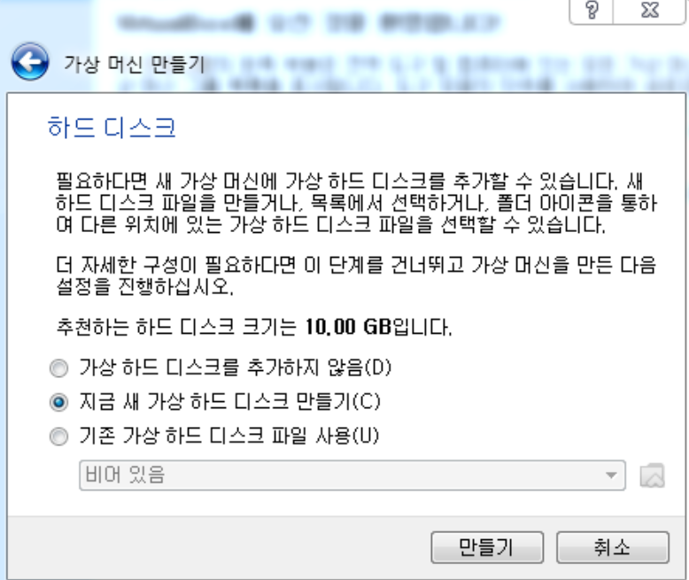

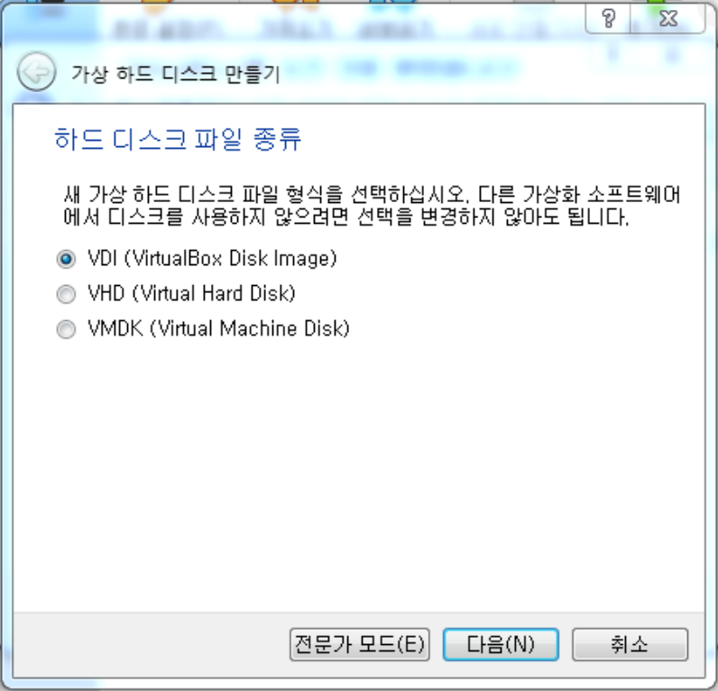

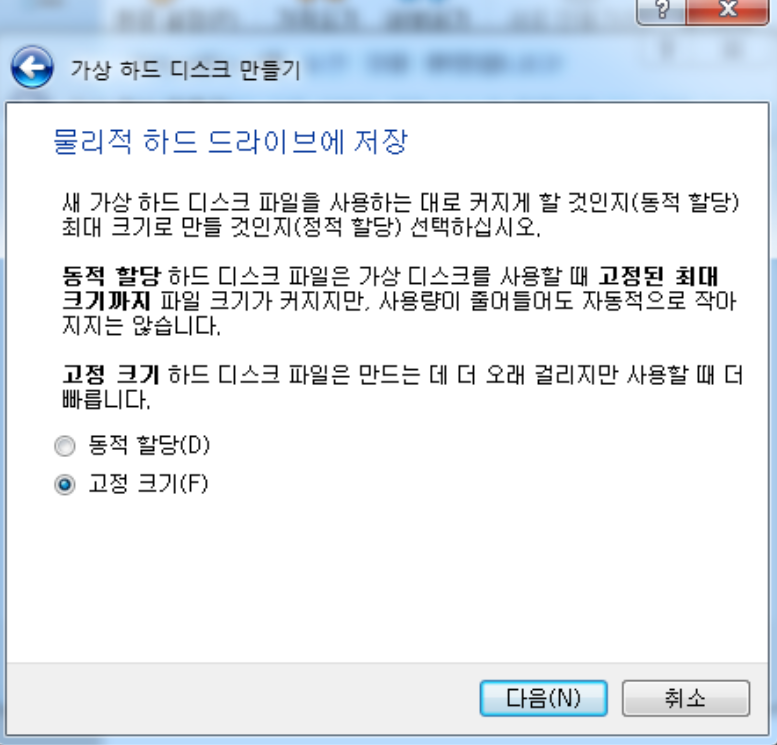

> 하드 공간 절약을 원한다면 동적할당, 빠른 속도를 원한다면 고정 크기 선택 

### 5) 가상 머신 설정

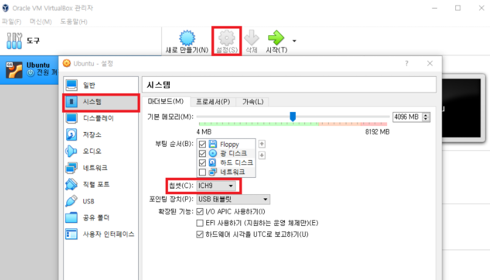

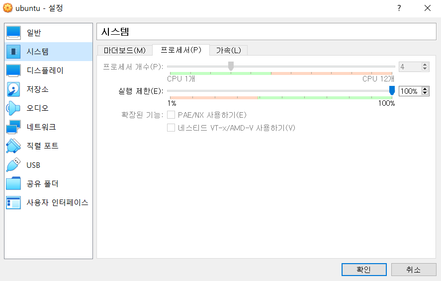

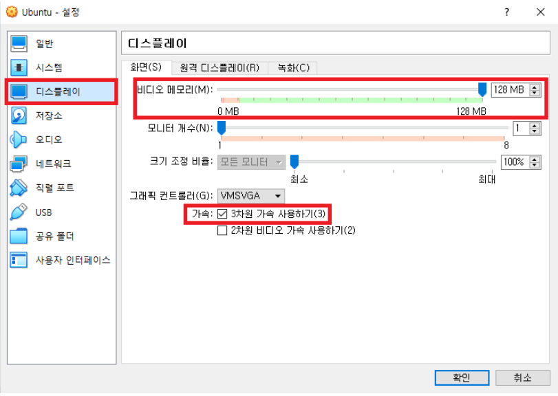

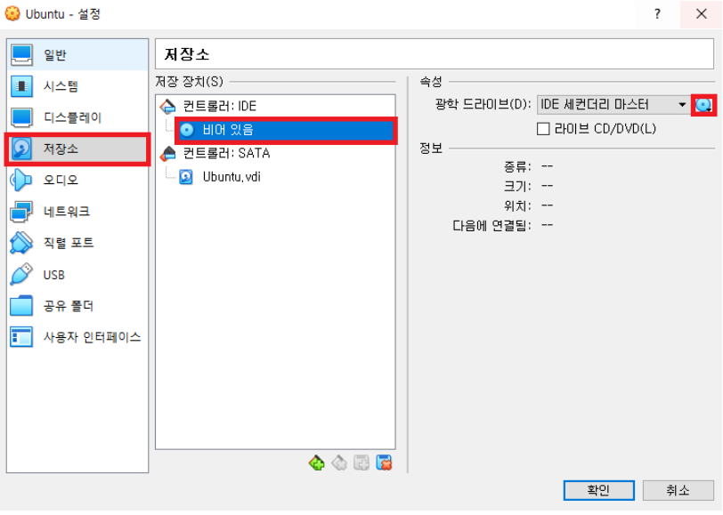

> 왼쪽 저장소 메뉴에서 부팅에 사용할 우분투 iso 이미지를 가상광학드라이브에 삽입

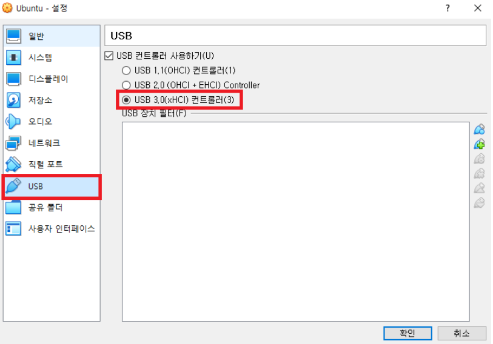

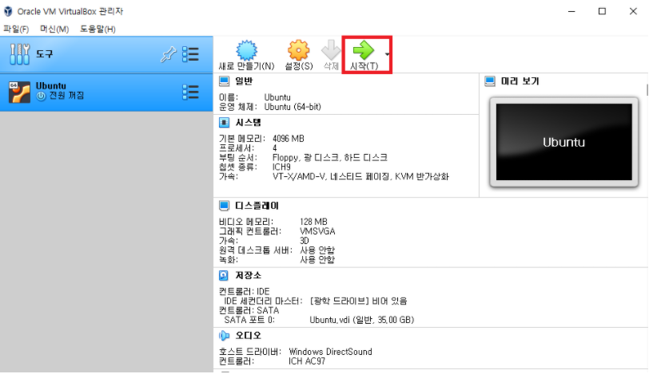

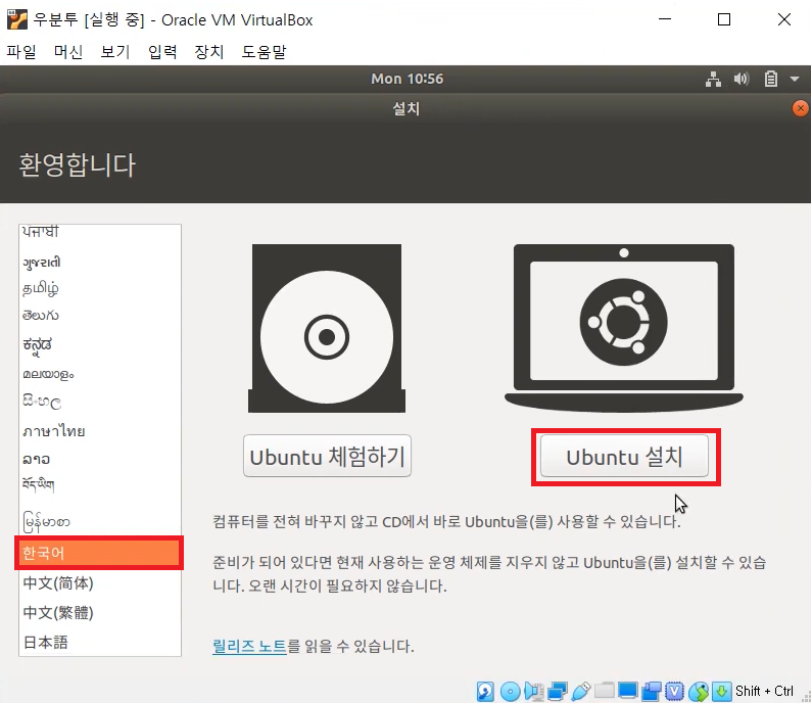

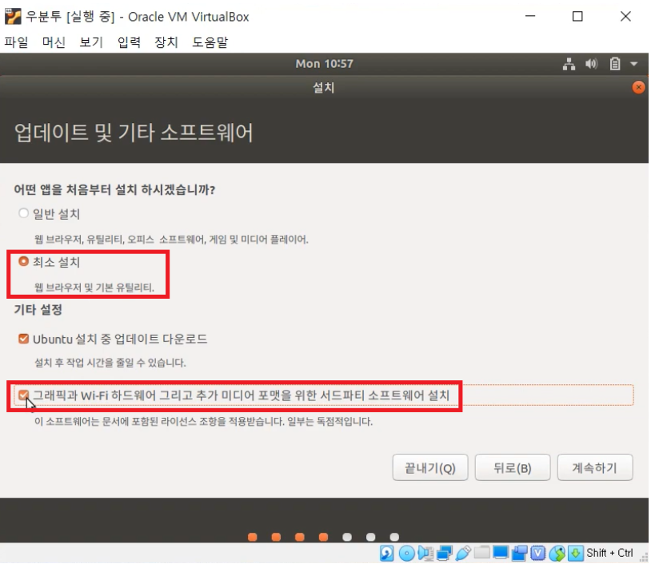

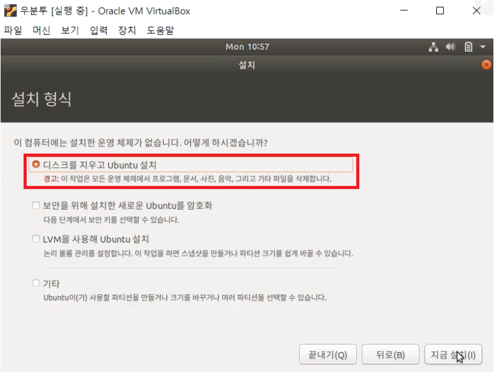

