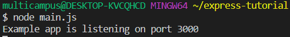

# node.js

## 1. node.js

> 브라우저가 아닌 환경에서도 자바스크립트를 사용할 수 있게 하는 자바스크립트 런타임
>
> - node.js는 웹 서버가 아니다. 
> - 웹 서버는 html 파일 경로를 지정해주고, 서버를 열고, 세션 이런것도 관리해주는데  node.js는 http 서버를 직접 작성해야 한다
> - 그저 코드를 실행할 수 있는 하나의 방법에 불과하는 자바스크립트 런타임 일 뿐 


## 2. Express

> 웹 서버에서 필요한 대부분의 기능이 이미 구현된 웹 프레임 워크
>
> 라우팅, 세션, 템플릿 등 웹 어플리케이션을 만들면서 필요한 기능 이미 구현됨


## 3. 문법

#### 1. Hellow World! 

```js
var express = require('express');
var app = express(); // express app 생성

// req: 요청, red: 응답
app.get('/', function(req, res) {
  // '/' 여기로 get 요청이 들어오면 
  res.send('Hello World!');
});

app.listen(3000, function() {
  console.log('Example app is listening on port 3000');
})

```




#### 2. 라우팅 

```js
// app.METHOD(PATH, HANDLER)
// METHOD : HTTP 요청 메소드 - get, post, delete, put ...
// PATH : 라우트 경로
// HANDLER : 실행 될 콜백 함수

app.get('/user/:id', function(req, res) {
    res.send('Received a GET request, param:' + req.params.id);
})

app.post('/user', function(req,res) {
    res.json({ success : true })
})

app.put('/user', function(req, res) {
    res.status(400).json({ message : 'Hey, you. Bad Request !'})
})

app.delete('/user', function(req, res){
    res.send('Received a DELETE request');
})

app.listen(3000, function() {
    console.log('Exampel app is listening on port 3000')
})
```


